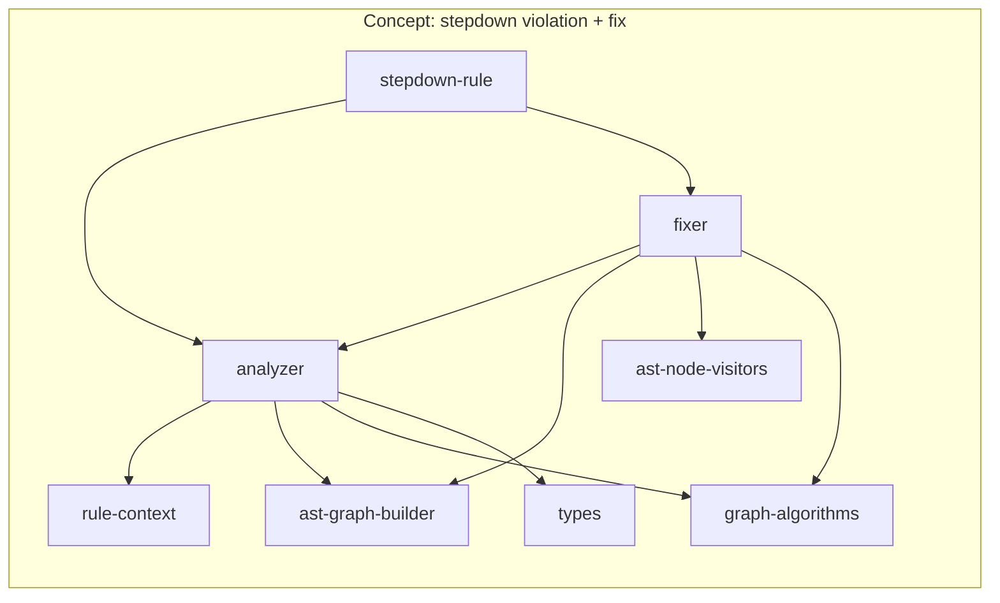

<!-- Generated by SpecStory, Markdown v2.1.0 -->

# 2026-07-27 03:31:31Z

<!-- Cursor IDE Session 4612a129-1a0b-4555-990d-3f48307af4c5 (2026-07-27 03:31:31Z) -->

_**User**_

Explore the stepdown-rule codebase at C:\Users\graff\WebstormProjects\stepdown-rule for architectural friction and deepening opportunities.

Context: This is @stepdown/analyzer — TypeScript AST analyzer/fixer enforcing stepdown rule (callers above callees) and nested function rule.

Architecture vocabulary to use (report findings with these exact terms):
- module, interface, depth, deep, shallow, seam, adapter, leverage, locality
- deletion test: would deleting a module concentrate complexity or just move it?

NO CONTEXT.md or docs/adr/ exist — use CLAUDE.md and docs/ for domain language.

Explore organically. Focus on src/ especially:
- analyzer.ts, fixer.ts, registry.ts, rule-context.ts
- stepdown-rule.ts, nested-rule.ts
- ast-graph-builder.ts, ast-node-visitors.ts, ast-utils.ts, graph-algorithms.ts
- cli.ts, services/FileService.ts
- Any other src files that look shallow or leaky

For each friction point return:
1. Title (deepening opportunity name)
2. Files involved
3. Problem (why shallow/leaky/no locality) — use architecture vocabulary
4. Solution sketch (what would deepen)
5. Deletion-test result
6. Recommendation strength: Strong | Worth exploring | Speculative
7. Dependency category: in-process | local-substitutable | ports & adapters | mock
8. Concrete evidence (function names, import graphs, line counts if useful)

Also report:
- Overall module map (what's deep vs shallow)
- Where understanding one concept requires bouncing between many modules
- Untested or hard-to-test areas through current interfaces
- Any prior architecture notes in docs/

Be very thorough. Return structured findings ready to turn into an architecture review HTML report.

---

_**Agent (default)**_

<think><details><summary>Thought Process</summary>
Beginning a thorough architectural audit of the stepdown-rule codebase. I will map module depth and locality, trace dependency categories, identify untested interfaces, and flag any deletion-test friction.

Reading CLAUDE.md and docs/ first. Then mapping src/ modules and tracing dependencies. Findings will use the exact architecture vocabulary requested.
</details></think>

_**Agent (default)**_

I'll map the architecture and dig into the core `src/` modules for friction and deepening opportunities.

_**Agent (default)**_

<tool-use data-tool-type="unknown" data-tool-name="update_current_step"><details>
<summary>Tool use: **update_current_step**</summary>
An unknown error occurred
</details></tool-use>

_**Agent (default)**_

<tool-use data-tool-type="read" data-tool-name="read_file_v2"><details>
<summary>Tool use: **read_file_v2** • Read file: C:\Users\graff\.agents\skills\architecture-code\SKILL.md</summary>

</details></tool-use>

_**Agent (default)**_

<tool-use data-tool-type="search" data-tool-name="glob_file_search"><details>
<summary>Tool use: **glob_file_search** • Searched codebase "" • **26** results in **1** directory</summary>

Directory: **`C:\Users\graff\WebstormProjects\stepdown-rule`** (26 files)

| File |
|------|
| `../.\src\services\FileService.ts` |
| `../.\src\analyzer.ts` |
| `../.\src\cli.ts` |
| `../.\src\fixer.ts` |
| `../.\src\graph-algorithms.ts` |
| `../.\src\ast-graph-builder.ts` |
| `../.\src\cli-agents.ts` |
| `../.\src\cli-output.ts` |
| `../.\src\cli-errors.ts` |
| `../.\src\cli-json.ts` |
| `../.\src\ast-node-visitors.ts` |
| `../.\src\rule-context.ts` |
| `../.\src\cli-runners.ts` |
| `../.\src\cli-options.ts` |
| `../.\src\violation-coverage.ts` |
| `../.\src\stepdown-rule.ts` |
| `../.\src\types.ts` |
| `../.\src\ast-utils.ts` |
| `../.\src\nested-rule.ts` |
| `../.\src\registry.ts` |
| `../.\src\index.ts` |
| `../.\src\exit-codes.ts` |
| `../.\src\config\loader.ts` |
| `../.\src\config\schema.ts` |
| `../.\src\services\types.ts` |
| `../.\src\register-default-rules.ts` |
</details></tool-use>

_**Agent (default)**_

<tool-use data-tool-type="search" data-tool-name="glob_file_search"><details>
<summary>Tool use: **glob_file_search** • Searched codebase "" • **14** results in **1** directory</summary>

Directory: **`C:\Users\graff\WebstormProjects\stepdown-rule`** (14 files)

| File |
|------|
| `../docs/post-mortems/2026-03-03-expert-review-to-beads.md` |
| `../docs/post-mortems/2026-03-02-circular-dep-exit-code.md` |
| `../docs/post-mortems/2026-03-03-triple-bugfix-session.md` |
| `../docs/post-mortems/2026-03-17-fixer-four-bugs.md` |
| `../docs/PRD.md` |
| `../docs/post-mortems/2026-05-27-cli-executable-accessibility.md` |
| `../docs\post-mortems\2026-07-26-compile-size-audit.md` |
| `../docs\post-mortems\2026-07-26-unilateral-bead-deferral.md` |
| `../docs\post-mortems\2026-07-26-simplify-review-release.md` |
| `../docs/post-mortems/2026-03-02-file-consolidation.md` |
| `../docs\post-mortems\2026-05-27-cli-executable-accessibility.md` |
| `../docs/post-mortems/2026-03-02-fresh-eyes-bug-hunt.md` |
| `../docs/post-mortems/2026-03-03-verbose-help-revert.md` |
| `../docs/rule-pipeline-architecture.md` |
</details></tool-use>

_**Agent (default)**_

<tool-use data-tool-type="shell" data-tool-name="run_terminal_command_v2"><details>
<summary>Tool use: **run_terminal_command_v2** • Run command: ms suggest --machine --cwd . 2&gt;$null; Get-ChildItem -Path src -Recurse -File -Filter *.ts | ForEach-Object { $lines = (Get-Content $_.FullName | Measure-Object -Line).Lines; &#34;$lines`t$($_.FullName.Replace((Get-Location).Path + &#39;\&#39;, &#39;&#39;))&#34; } | Sort-Object { [int]($_ -split &#34;`t&#34;)[0] } -Descending</summary>
```bash
ms suggest --machine --cwd . 2>$null; Get-ChildItem -Path src -Recurse -File -Filter *.ts | ForEach-Object { $lines = (Get-Content $_.FullName | Measure-Object -Line).Lines; "$lines`t$($_.FullName.Replace((Get-Location).Path + '\', ''))" } | Sort-Object { [int]($_ -split "`t")[0] } -Descending
```

```
{
  "status": "ok",
  "context": {
    "cwd": "C:\\Users\\graff\\WebstormProjects\\stepdown-rule",
    "recent_files": [
      ".\\.specstory\\history\\2026-07-27_03-31-31Z-explore-architecture-friction.md",
      ".\\.specstory\\statistics.json",
      ".\\.specstory\\history\\2026-07-27_02-57-10Z-codebase-architecture-improvement.md",
      ".\\CHANGELOG.md",
      ".\\package.json",
      ".\\AGENTS.md",
      ".\\stepdown-schema.json",
      ".\\.specstory\\history\\2026-07-27_01-46-14Z-cross-platform-installation-command.md",
      ".\\docs\\post-mortems\\2026-07-26-simplify-review-release.md",
      ".\\docs\\post-mortems\\2026-07-26-unilateral-bead-deferral.md"
    ],
    "fingerprint": 6935618296745955843
  },
  "suggestions": [
    {
      "skill_id": "deployment",
      "name": "deployment",
      "description": "Consolidated deployment, reliability, orchestration, and configuration.",
      "confidence": 0.7499203,
      "is_discovery": false,
      "tags": []
    },
    {
      "skill_id": "surrealdb",
      "name": "surrealdb",
      "description": "SurrealDB administration, SurrealQL, schema design, deployment, and CLI operations.",
      "confidence": 0.7495233,
      "is_discovery": false,
      "tags": []
    },
    {
      "skill_id": "debug-reprex",
      "name": "debug-reprex",
      "description": "Guidance for creating minimal reproducible examples (reprex, MCVE, SSCCE, minimal example, reproducible example",
      "confidence": 0.74639237,
      "is_discovery": false,
      "tags": []
    },
    {
      "skill_id": "bootstrap-toolkit-claude",
      "name": "bootstrap-toolkit-claude",
      "description": "Wire br, toon, ms, cass, gh, and ubs into a fresh project",
      "confidence": 0.7458547,
      "is_discovery": false,
      "tags": []
    },
    {
      "skill_id": "add-council-member",
      "name": "add-council-member",
      "description": "Add a new expert to the council-review panel — interviews for domain info, generates agent file,
… (output truncated)
```
</details></tool-use>

_**Agent (default)**_

<think><details><summary>Thought Process</summary>
Loading the architecture skill and reading key source files and docs in parallel.
</details></think>

_**Agent (default)**_

<tool-use data-tool-type="read" data-tool-name="read_file_v2"><details>
<summary>Tool use: **read_file_v2** • Read file: C:\Users\graff\.agents\skills\architecture-code\subskill\improve-codebase-architecture\SKILL.md</summary>

</details></tool-use>

_**Agent (default)**_

<tool-use data-tool-type="read" data-tool-name="read_file_v2"><details>
<summary>Tool use: **read_file_v2** • Read file: C:\Users\graff\WebstormProjects\stepdown-rule\docs\rule-pipeline-architecture.md</summary>

</details></tool-use>

_**Agent (default)**_

<tool-use data-tool-type="read" data-tool-name="read_file_v2"><details>
<summary>Tool use: **read_file_v2** • Read file: C:\Users\graff\WebstormProjects\stepdown-rule\src\rule-context.ts</summary>

</details></tool-use>

_**Agent (default)**_

<tool-use data-tool-type="read" data-tool-name="read_file_v2"><details>
<summary>Tool use: **read_file_v2** • Read file: C:\Users\graff\WebstormProjects\stepdown-rule\src\registry.ts</summary>

</details></tool-use>

_**Agent (default)**_

<tool-use data-tool-type="read" data-tool-name="read_file_v2"><details>
<summary>Tool use: **read_file_v2** • Read file: C:\Users\graff\WebstormProjects\stepdown-rule\src\stepdown-rule.ts</summary>

</details></tool-use>

_**Agent (default)**_

<tool-use data-tool-type="read" data-tool-name="read_file_v2"><details>
<summary>Tool use: **read_file_v2** • Read file: C:\Users\graff\WebstormProjects\stepdown-rule\src\nested-rule.ts</summary>

</details></tool-use>

_**Agent (default)**_

<tool-use data-tool-type="read" data-tool-name="read_file_v2"><details>
<summary>Tool use: **read_file_v2** • Read file: C:\Users\graff\WebstormProjects\stepdown-rule\src\types.ts</summary>

</details></tool-use>

_**Agent (default)**_

<tool-use data-tool-type="read" data-tool-name="read_file_v2"><details>
<summary>Tool use: **read_file_v2** • Read file: C:\Users\graff\WebstormProjects\stepdown-rule\src\register-default-rules.ts</summary>

</details></tool-use>

_**Agent (default)**_

<tool-use data-tool-type="read" data-tool-name="read_file_v2"><details>
<summary>Tool use: **read_file_v2** • Read file: C:\Users\graff\WebstormProjects\stepdown-rule\src\index.ts</summary>

</details></tool-use>

_**Agent (default)**_

<think><details><summary>Thought Process</summary>
The analysis begins with analyzer.ts, fixer.ts, and the AST modules.

The next step is to read the improve-codebase-architecture output format and workflow, then trace imports and key functions.
</details></think>

_**Agent (default)**_

<tool-use data-tool-type="read" data-tool-name="read_file_v2"><details>
<summary>Tool use: **read_file_v2** • Read file: C:\Users\graff\.agents\skills\architecture-code\subskill\improve-codebase-architecture\references\output-format.md</summary>

</details></tool-use>

_**Agent (default)**_

<tool-use data-tool-type="read" data-tool-name="read_file_v2"><details>
<summary>Tool use: **read_file_v2** • Read file: C:\Users\graff\.agents\skills\architecture-code\subskill\improve-codebase-architecture\REFERENCE.md</summary>

</details></tool-use>

_**Agent (default)**_

<tool-use data-tool-type="unknown" data-tool-name="update_current_step"><details>
<summary>Tool use: **update_current_step**</summary>
An unknown error occurred
</details></tool-use>

_**Agent (default)**_

<tool-use data-tool-type="unknown" data-tool-name="ripgrep_raw_search"><details>
<summary>Tool use: **ripgrep_raw_search**</summary>

Parameters:

```json
{
  "caseInsensitive": false,
  "glob": "*.ts",
  "path": "C:\\Users\\graff\\WebstormProjects\\stepdown-rule\\src",
  "pattern": "^(export )?(async )?function |^export const |^export class |^export interface |^export type"
}
```
Additional data:

```json
{
  "isPruned": true,
  "outputMode": "content",
  "path": "C:\\Users\\graff\\WebstormProjects\\stepdown-rule\\src",
  "pattern": "^(export )?(async )?function |^export const |^export class |^export interface |^export type",
  "topFiles": [
    {
      "matchCount": 7,
      "uri": "src\\services\\FileService.ts"
    },
    {
      "matchCount": 40,
      "uri": "src\\analyzer.ts"
    },
    {
      "matchCount": 14,
      "uri": "src\\cli.ts"
    },
    {
      "matchCount": 27,
      "uri": "src\\fixer.ts"
    },
    {
      "matchCount": 10,
      "uri": "src\\graph-algorithms.ts"
    },
    {
      "matchCount": 7,
      "uri": "src\\cli-agents.ts"
    },
    {
      "matchCount": 10,
      "uri": "src\\ast-node-visitors.ts"
    },
    {
      "matchCount": 7,
      "uri": "src\\ast-graph-builder.ts"
    },
    {
      "matchCount": 4,
      "uri": "src\\cli-json.ts"
    },
    {
      "matchCount": 3,
      "uri": "src\\cli-errors.ts"
    },
    {
      "matchCount": 16,
      "uri": "src\\cli-output.ts"
    },
    {
      "matchCount": 4,
      "uri": "src\\rule-context.ts"
    },
    {
      "matchCount": 6,
      "uri": "src\\cli-options.ts"
    },
    {
      "matchCount": 6,
      "uri": "src\\cli-runners.ts"
    },
    {
      "matchCount": 6,
      "uri": "src\\violation-coverage.ts"
    },
    {
      "matchCount": 1,
      "uri": "src\\stepdown-rule.ts"
    },
    {
      "matchCount": 7,
      "uri": "src\\types.ts"
    },
    {
      "matchCount": 3,
      "uri": "src\\ast-utils.ts"
    },
    {
      "matchCount": 1,
      "uri": "src\\nested-rule.ts"
    },
    {
      "matchCount": 3,
      "uri": "src\\registry.ts"
    }
  ],
  "totalFiles": 24,
  "totalMatches": 206
}
```
Status: **completed**

</details></tool-use>

_**Agent (default)**_

<tool-use data-tool-type="unknown" data-tool-name="ripgrep_raw_search"><details>
<summary>Tool use: **ripgrep_raw_search**</summary>

Parameters:

```json
{
  "caseInsensitive": false,
  "glob": "*.ts",
  "path": "C:\\Users\\graff\\WebstormProjects\\stepdown-rule\\src",
  "pattern": "^import"
}
```
Additional data:

```json
{
  "isPruned": true,
  "outputMode": "content",
  "path": "C:\\Users\\graff\\WebstormProjects\\stepdown-rule\\src",
  "pattern": "^import",
  "topFiles": [
    {
      "matchCount": 6,
      "uri": "src\\services\\FileService.ts"
    },
    {
      "matchCount": 9,
      "uri": "src/analyzer.ts"
    },
    {
      "matchCount": 1,
      "uri": "src/cli-options.ts"
    },
    {
      "matchCount": 10,
      "uri": "src/fixer.ts"
    },
    {
      "matchCount": 2,
      "uri": "src/rule-context.ts"
    },
    {
      "matchCount": 3,
      "uri": "src/stepdown-rule.ts"
    },
    {
      "matchCount": 1,
      "uri": "src/services/types.ts"
    },
    {
      "matchCount": 3,
      "uri": "src/register-default-rules.ts"
    },
    {
      "matchCount": 1,
      "uri": "src/registry.ts"
    },
    {
      "matchCount": 10,
      "uri": "src/cli-agents.ts"
    },
    {
      "matchCount": 3,
      "uri": "src/nested-rule.ts"
    },
    {
      "matchCount": 1,
      "uri": "src/ast-utils.ts"
    },
    {
      "matchCount": 2,
      "uri": "src/ast-graph-builder.ts"
    },
    {
      "matchCount": 1,
      "uri": "src/cli-json.ts"
    },
    {
      "matchCount": 6,
      "uri": "src/cli-runners.ts"
    },
    {
      "matchCount": 4,
      "uri": "src/cli-output.ts"
    },
    {
      "matchCount": 2,
      "uri": "src/config/loader.ts"
    },
    {
      "matchCount": 1,
      "uri": "src/config/schema.ts"
    },
    {
      "matchCount": 6,
      "uri": "src/services/FileService.ts"
    },
    {
      "matchCount": 2,
      "uri": "src/ast-node-visitors.ts"
    }
  ],
  "totalFiles": 21,
  "totalMatches": 87
}
```
Status: **completed**

</details></tool-use>

_**Agent (default)**_

<tool-use data-tool-type="read" data-tool-name="read_file_v2"><details>
<summary>Tool use: **read_file_v2** • Read file: C:\Users\graff\WebstormProjects\stepdown-rule\src\analyzer.ts</summary>

</details></tool-use>

_**Agent (default)**_

<tool-use data-tool-type="read" data-tool-name="read_file_v2"><details>
<summary>Tool use: **read_file_v2** • Read file: C:\Users\graff\WebstormProjects\stepdown-rule\src\fixer.ts</summary>

</details></tool-use>

_**Agent (default)**_

<think><details><summary>Thought Process</summary>
The core architecture is becoming clear. Next I will read analyzer.ts, fixer.ts, the dual pipelines, AST modules, and FileService. I will also check test coverage patterns.

I will also check docs for prior architecture notes and investigate the dual-path issue between analyzeParsedFile and analyzeWithRules.
</details></think>

_**Agent (default)**_

Next I'll dig into dual pipelines, AST seams, and where tests attach.

_**Agent (default)**_

<tool-use data-tool-type="read" data-tool-name="read_file_v2"><details>
<summary>Tool use: **read_file_v2** • Read file: C:\Users\graff\WebstormProjects\stepdown-rule\src\analyzer.ts</summary>

</details></tool-use>

_**Agent (default)**_

<tool-use data-tool-type="read" data-tool-name="read_file_v2"><details>
<summary>Tool use: **read_file_v2** • Read file: C:\Users\graff\WebstormProjects\stepdown-rule\src\fixer.ts</summary>

</details></tool-use>

_**Agent (default)**_

<tool-use data-tool-type="read" data-tool-name="read_file_v2"><details>
<summary>Tool use: **read_file_v2** • Read file: C:\Users\graff\WebstormProjects\stepdown-rule\src\ast-graph-builder.ts</summary>

</details></tool-use>

_**Agent (default)**_

<tool-use data-tool-type="read" data-tool-name="read_file_v2"><details>
<summary>Tool use: **read_file_v2** • Read file: C:\Users\graff\WebstormProjects\stepdown-rule\src\services\FileService.ts</summary>

</details></tool-use>

_**Agent (default)**_

<tool-use data-tool-type="read" data-tool-name="read_file_v2"><details>
<summary>Tool use: **read_file_v2** • Read file: C:\Users\graff\WebstormProjects\stepdown-rule\src\services\types.ts</summary>

</details></tool-use>

_**Agent (default)**_

<tool-use data-tool-type="search" data-tool-name="glob_file_search"><details>
<summary>Tool use: **glob_file_search** • Searched codebase "" • **21** results in **1** directory</summary>

Directory: **`C:\Users\graff\WebstormProjects\stepdown-rule`** (21 files)

| File |
|------|
| `../tests/stepdown-nested-rules.test.ts` |
| `../tests\rule-fix-coverage.test.ts` |
| `../tests/analyzer-fixer-unified.test.ts` |
| `../tests/vic-pipeline.test.ts` |
| `../tests/rule-fix-coverage.test.ts` |
| `../tests/nested-functions.test.ts` |
| `../tests/registry.test.ts` |
| `../tests\idempotency.test.ts` |
| `../tests/fixer.test.ts` |
| `../tests/helpers.ts` |
| `../tests\file-service.test.ts` |
| `../tests/cli.test.ts` |
| `../tests\temp-157b9020\test.ts` |
| `../tests\temp-25ef87ff\test.ts` |
| `../tests/unified-modules.test.ts` |
| `../tests/analyzer.test.ts` |
| `../tests\temp-5f08daa6\test.ts` |
| `../tests/file-service.test.ts` |
| `../tests/rule-context.test.ts` |
| `../tests/idempotency.test.ts` |
| `../tests/analysis-fix-coverage.test.ts` |
</details></tool-use>

_**Agent (default)**_

<tool-use data-tool-type="unknown" data-tool-name="ripgrep_raw_search"><details>
<summary>Tool use: **ripgrep_raw_search**</summary>

Parameters:

```json
{
  "caseInsensitive": false,
  "path": "C:\\Users\\graff\\WebstormProjects\\stepdown-rule\\tests",
  "pattern": "from [\"']\\.\\./src/|from [\"']@stepdown|analyzeParsedFile|analyzeWithRules|fixFileWithRules|buildRuleContext|runPipeline|reorderTopLevelOnly|applyNestedOnly|FileService|registry|ViolationRule"
}
```
Additional data:

```json
{
  "isPruned": true,
  "outputMode": "content",
  "path": "C:\\Users\\graff\\WebstormProjects\\stepdown-rule\\tests",
  "pattern": "from [\"']\\.\\./src/|from [\"']@stepdown|analyzeParsedFile|analyzeWithRules|fixFileWithRules|buildRuleContext|runPipeline|reorderTopLevelOnly|applyNestedOnly|FileService|registry|ViolationRule",
  "topFiles": [
    {
      "matchCount": 2,
      "uri": "tests/idempotency.test.ts"
    },
    {
      "matchCount": 2,
      "uri": "tests\\idempotency.test.ts"
    },
    {
      "matchCount": 8,
      "uri": "tests/registry.test.ts"
    },
    {
      "matchCount": 1,
      "uri": "tests/fixer.test.ts"
    },
    {
      "matchCount": 4,
      "uri": "tests/vic-pipeline.test.ts"
    },
    {
      "matchCount": 5,
      "uri": "tests/rule-context.test.ts"
    },
    {
      "matchCount": 3,
      "uri": "tests/analyzer-fixer-unified.test.ts"
    },
    {
      "matchCount": 5,
      "uri": "tests/helpers.ts"
    },
    {
      "matchCount": 8,
      "uri": "tests/file-service.test.ts"
    },
    {
      "matchCount": 1,
      "uri": "tests/nested-functions.test.ts"
    },
    {
      "matchCount": 9,
      "uri": "tests\\rule-fix-coverage.test.ts"
    },
    {
      "matchCount": 8,
      "uri": "tests\\file-service.test.ts"
    },
    {
      "matchCount": 1,
      "uri": "tests/analysis-fix-coverage.test.ts"
    },
    {
      "matchCount": 1,
      "uri": "tests/analyzer.test.ts"
    },
    {
      "matchCount": 9,
      "uri": "tests/rule-fix-coverage.test.ts"
    },
    {
      "matchCount": 4,
      "uri": "tests/unified-modules.test.ts"
    },
    {
      "matchCount": 16,
      "uri": "tests/stepdown-nested-rules.test.ts"
    }
  ],
  "totalFiles": 17,
  "totalMatches": 87
}
```
Status: **completed**

</details></tool-use>

_**Agent (default)**_

<tool-use data-tool-type="unknown" data-tool-name="ripgrep_raw_search"><details>
<summary>Tool use: **ripgrep_raw_search**</summary>

Parameters:

```json
{
  "caseInsensitive": true,
  "path": "C:\\Users\\graff\\WebstormProjects\\stepdown-rule\\docs",
  "pattern": "architecture|shallow|deep|pipeline|plugin|registry|seam|adapter|dual|legacy"
}
```
Additional data:

```json
{
  "isPruned": true,
  "outputMode": "content",
  "path": "C:\\Users\\graff\\WebstormProjects\\stepdown-rule\\docs",
  "pattern": "architecture|shallow|deep|pipeline|plugin|registry|seam|adapter|dual|legacy",
  "topFiles": [
    {
      "matchCount": 1,
      "uri": "docs/PRD.md"
    },
    {
      "matchCount": 5,
      "uri": "docs/post-mortems/2026-03-17-fixer-four-bugs.md"
    },
    {
      "matchCount": 2,
      "uri": "docs/post-mortems/2026-03-02-circular-dep-exit-code.md"
    },
    {
      "matchCount": 2,
      "uri": "docs/post-mortems/2026-03-03-triple-bugfix-session.md"
    },
    {
      "matchCount": 10,
      "uri": "docs/class.mmd"
    },
    {
      "matchCount": 7,
      "uri": "docs/post-mortems/2026-03-03-expert-review-to-beads.md"
    },
    {
      "matchCount": 1,
      "uri": "docs/post-mortems/2026-05-27-cli-executable-accessibility.md"
    },
    {
      "matchCount": 3,
      "uri": "docs/post-mortems/2026-03-02-file-consolidation.md"
    },
    {
      "matchCount": 34,
      "uri": "docs/rule-pipeline-architecture.md"
    },
    {
      "matchCount": 1,
      "uri": "docs\\post-mortems\\2026-05-27-cli-executable-accessibility.md"
    },
    {
      "matchCount": 2,
      "uri": "docs\\post-mortems\\2026-07-26-simplify-review-release.md"
    },
    {
      "matchCount": 2,
      "uri": "docs/post-mortems/2026-03-02-fresh-eyes-bug-hunt.md"
    }
  ],
  "totalFiles": 12,
  "totalMatches": 70
}
```
Status: **completed**

</details></tool-use>

_**Agent (default)**_

<think><details><summary>Thought Process</summary>
The overall module map and dependency structure are becoming clear. I am now drilling deeper into specific friction points and architectural seams.

Dual pipelines exist alongside each other: `analyzeParsedFile` versus `analyzeWithRules`, and `fixParsedFile` versus `fixFileWithRules`. Rule shells are shallow delegates rather than independent modules. Call graph logic is duplicated between `analyzer.buildCallGraph` and `ast-graph-builder`. `AnalysisResult` mixes split violation fields with a `Violation` union type. `FileService` exposes `IFileService` but callers still depend on the concrete implementation. CLI logic is fragmented across many shallow modules.

RunPipeline is documented as a standalone use case but is actually embedded inside `fixer.ts`. A circular dependency exists between `rules`, `analyzer/fixer`, and `registry`: `rules` imports `analyzer/fixer`, while `analyzer` imports `registry`.
</details></think>

_**Agent (default)**_

<tool-use data-tool-type="unknown" data-tool-name="update_current_step"><details>
<summary>Tool use: **update_current_step**</summary>
An unknown error occurred
</details></tool-use>

_**Agent (default)**_

<tool-use data-tool-type="read" data-tool-name="read_file_v2"><details>
<summary>Tool use: **read_file_v2** • Read file: C:\Users\graff\WebstormProjects\stepdown-rule\src\analyzer.ts</summary>

</details></tool-use>

_**Agent (default)**_

<tool-use data-tool-type="read" data-tool-name="read_file_v2"><details>
<summary>Tool use: **read_file_v2** • Read file: C:\Users\graff\WebstormProjects\stepdown-rule\src\graph-algorithms.ts</summary>

</details></tool-use>

_**Agent (default)**_

<tool-use data-tool-type="read" data-tool-name="read_file_v2"><details>
<summary>Tool use: **read_file_v2** • Read file: C:\Users\graff\WebstormProjects\stepdown-rule\src\ast-node-visitors.ts</summary>

</details></tool-use>

_**Agent (default)**_

<tool-use data-tool-type="read" data-tool-name="read_file_v2"><details>
<summary>Tool use: **read_file_v2** • Read file: C:\Users\graff\WebstormProjects\stepdown-rule\src\cli-runners.ts</summary>

</details></tool-use>

_**Agent (default)**_

<tool-use data-tool-type="read" data-tool-name="read_file_v2"><details>
<summary>Tool use: **read_file_v2** • Read file: C:\Users\graff\WebstormProjects\stepdown-rule\docs\PRD.md</summary>

</details></tool-use>

_**Agent (default)**_

<tool-use data-tool-type="unknown" data-tool-name="ripgrep_raw_search"><details>
<summary>Tool use: **ripgrep_raw_search**</summary>

Parameters:

```json
{
  "caseInsensitive": false,
  "path": "C:\\Users\\graff\\WebstormProjects\\stepdown-rule",
  "pattern": "enabledRuleIds|useRulePipeline|dual path|analyzeParsedFile|fixParsedFile|reorderFunctionDeclarations|IFileService"
}
```
Additional data:

```json
{
  "isPruned": true,
  "outputMode": "content",
  "path": "C:\\Users\\graff\\WebstormProjects\\stepdown-rule",
  "pattern": "enabledRuleIds|useRulePipeline|dual path|analyzeParsedFile|fixParsedFile|reorderFunctionDeclarations|IFileService",
  "topFiles": [
    {
      "matchCount": 1,
      "uri": ".specstory/history/2026-02-13_23-26Z-bead-completion-using-tdd.md"
    },
    {
      "matchCount": 3,
      "uri": ".beads\\.br_history\\issues.20260727_025054_423416900.jsonl"
    },
    {
      "matchCount": 1,
      "uri": ".specstory\\history\\2026-07-27_02-35-13Z-audit-8-stale-beads.md"
    },
    {
      "matchCount": 3,
      "uri": ".specstory/history/2026-02-14_00-47Z-stepdown-violation-analysis-and-remediation.md"
    },
    {
      "matchCount": 97,
      "uri": ".specstory/history/2026-02-14_00-12Z-bead-epic-stepdown-rule-kf2-planning.md"
    },
    {
      "matchCount": 1,
      "uri": "src/config/schema.ts"
    },
    {
      "matchCount": 3,
      "uri": ".beads\\issues.jsonl"
    },
    {
      "matchCount": 2,
      "uri": "src\\services\\FileService.ts"
    },
    {
      "matchCount": 3,
      "uri": ".beads/issues.jsonl"
    },
    {
      "matchCount": 1,
      "uri": "CHANGELOG.md"
    },
    {
      "matchCount": 3,
      "uri": ".beads\\.br_history\\issues.20260727_023749_159970000.jsonl"
    },
    {
      "matchCount": 6,
      "uri": "tests/analyzer-fixer-unified.test.ts"
    },
    {
      "matchCount": 3,
      "uri": ".beads\\.br_history\\issues.20260727_023910_603512400.jsonl"
    },
    {
      "matchCount": 3,
      "uri": ".beads\\.br_history\\issues.20260727_023831_751778900.jsonl"
    },
    {
      "matchCount": 11,
      "uri": ".sisyphus/plans/decouple-file-io.md"
    },
    {
      "matchCount": 24,
      "uri": ".specstory/history/2026-02-13_23-33Z-clean-code-and-architecture-review.md"
    },
    {
      "matchCount": 16,
      "uri": ".specstory/history/2026-02-13_22-37Z-bug-bead-assignment-and-task-management.md"
    },
    {
      "matchCount": 2,
      "uri": "tests/helpers.ts"
    },
    {
      "matchCount": 1,
      "uri": "docs/post-mortems/2026-03-03-expert-review-to-beads.md"
    },
    {
      "matchCount": 2,
      "uri": "tests/rule-fix-coverage.test.ts"
    }
  ],
  "totalFiles": 45,
  "totalMatches": 305
}
```
Status: **completed**

</details></tool-use>

_**Agent (default)**_

<tool-use data-tool-type="shell" data-tool-name="run_terminal_command_v2"><details>
<summary>Tool use: **run_terminal_command_v2** • Run command: bd list --json 2&gt;$null | bun -e &#34;const d=[];let s=&#39;&#39;;process.stdin.on(&#39;data&#39;,c=&gt;s+=c);process.stdin.on(&#39;end&#39;,()=&gt;{try{const j=JSON.parse(s);const items=Array.isArray(j)?j:(j.issues||j);for(const i of items.slice(0,40)){console.log([i.id,i.status,i.priority,i.title].join(&#39;\t&#39;))}}catch(e){console.log(s.slice(0,2000))}})&#34;</summary>
```bash
bd list --json 2>$null | bun -e "const d=[];let s='';process.stdin.on('data',c=>s+=c);process.stdin.on('end',()=>{try{const j=JSON.parse(s);const items=Array.isArray(j)?j:(j.issues||j);for(const i of items.slice(0,40)){console.log([i.id,i.status,i.priority,i.title].join('\t'))}}catch(e){console.log(s.slice(0,2000))}})"
```

```


```
</details></tool-use>

_**Agent (default)**_

<think><details><summary>Thought Process</summary>
Rich evidence has been gathered. Additional checks are underway.

The audit now targets six concrete friction points. These include CLI dual-path usage, a circular import between rules and the analyzer/fixer, a leaky `visitDependencyNode` export from graph-algorithms, mismatched `AnalysisResult` and `Violation` shapes, prior post-mortem notes on dual paths, and whether `FileService.parse` mixes parsing with I/O. The `docs/class.mmd` diagram and expert review findings are also being checked.
</details></think>

_**Agent (default)**_

<tool-use data-tool-type="read" data-tool-name="read_file_v2"><details>
<summary>Tool use: **read_file_v2** • Read file: C:\Users\graff\WebstormProjects\stepdown-rule\docs\class.mmd</summary>

</details></tool-use>

_**Agent (default)**_

<tool-use data-tool-type="unknown" data-tool-name="ripgrep_raw_search"><details>
<summary>Tool use: **ripgrep_raw_search**</summary>

Parameters:

```json
{
  "caseInsensitive": false,
  "path": "C:\\Users\\graff\\WebstormProjects\\stepdown-rule\\src",
  "pattern": "enabledRuleIds|useRulePipeline|register-default|visitDependencyNode|filterOutCyclicFunctions|extractFunctionNames|findFirstNode|findNodes"
}
```
Additional data:

```json
{
  "isPruned": true,
  "outputMode": "content",
  "path": "C:\\Users\\graff\\WebstormProjects\\stepdown-rule\\src",
  "pattern": "enabledRuleIds|useRulePipeline|register-default|visitDependencyNode|filterOutCyclicFunctions|extractFunctionNames|findFirstNode|findNodes",
  "topFiles": [
    {
      "matchCount": 2,
      "uri": "src/cli-runners.ts"
    },
    {
      "matchCount": 4,
      "uri": "src/graph-algorithms.ts"
    },
    {
      "matchCount": 1,
      "uri": "src/cli.ts"
    },
    {
      "matchCount": 1,
      "uri": "src/ast-graph-builder.ts"
    },
    {
      "matchCount": 1,
      "uri": "src/config/schema.ts"
    },
    {
      "matchCount": 3,
      "uri": "src/analyzer.ts"
    },
    {
      "matchCount": 7,
      "uri": "src/fixer.ts"
    },
    {
      "matchCount": 2,
      "uri": "src/ast-node-visitors.ts"
    }
  ],
  "totalFiles": 8,
  "totalMatches": 21
}
```
Status: **completed**

</details></tool-use>

_**Agent (default)**_

<tool-use data-tool-type="read" data-tool-name="read_file_v2"><details>
<summary>Tool use: **read_file_v2** • Read file: C:\Users\graff\WebstormProjects\stepdown-rule\src\cli.ts</summary>

</details></tool-use>

_**Agent (default)**_

<tool-use data-tool-type="read" data-tool-name="read_file_v2"><details>
<summary>Tool use: **read_file_v2** • Read file: C:\Users\graff\WebstormProjects\stepdown-rule\tests\unified-modules.test.ts</summary>

</details></tool-use>

_**Agent (default)**_

<tool-use data-tool-type="read" data-tool-name="read_file_v2"><details>
<summary>Tool use: **read_file_v2** • Read file: C:\Users\graff\WebstormProjects\stepdown-rule\docs\post-mortems\2026-03-03-expert-review-to-beads.md</summary>

</details></tool-use>

_**Agent (default)**_

<tool-use data-tool-type="unknown" data-tool-name="ripgrep_raw_search"><details>
<summary>Tool use: **ripgrep_raw_search**</summary>

Parameters:

```json
{
  "caseInsensitive": false,
  "path": "C:\\Users\\graff\\WebstormProjects\\stepdown-rule\\tests",
  "pattern": "runPipeline|fixFileWithRules|analyzeWithRules|reorderTopLevelOnly|applyNestedOnly|buildCallGraph|IFileService"
}
```
Additional data:

```json
{
  "isPruned": true,
  "outputMode": "content",
  "path": "C:\\Users\\graff\\WebstormProjects\\stepdown-rule\\tests",
  "pattern": "runPipeline|fixFileWithRules|analyzeWithRules|reorderTopLevelOnly|applyNestedOnly|buildCallGraph|IFileService",
  "topFiles": [
    {
      "matchCount": 4,
      "uri": "tests/rule-fix-coverage.test.ts"
    },
    {
      "matchCount": 4,
      "uri": "tests\\rule-fix-coverage.test.ts"
    }
  ],
  "totalFiles": 2,
  "totalMatches": 8
}
```
Status: **completed**

</details></tool-use>

_**Agent (default)**_

<tool-use data-tool-type="read" data-tool-name="read_file_v2"><details>
<summary>Tool use: **read_file_v2** • Read file: C:\Users\graff\WebstormProjects\stepdown-rule\src\config\schema.ts</summary>

</details></tool-use>

_**Agent (default)**_

<tool-use data-tool-type="shell" data-tool-name="run_terminal_command_v2"><details>
<summary>Tool use: **run_terminal_command_v2** • Run command: bd ready --json 2&gt;&amp;1 | Select-Object -First 5; bd list --status=open --json 2&gt;&amp;1 | Select-Object -First 3; Get-ChildItem .beads -ErrorAction SilentlyContinue | Select-Object Name; rg -l &#34;stepdown-v3a|dual path|shallow|legacy&#34; .beads docs --glob &#34;*.md&#34; 2&gt;$null; rg &#34;stepdown-v3a|Align legacy|dual&#34; .beads -g &#34;*.jsonl&#34; -n --max-count 5 2&gt;$null</summary>
```bash
bd ready --json 2>&1 | Select-Object -First 5; bd list --status=open --json 2>&1 | Select-Object -First 3; Get-ChildItem .beads -ErrorAction SilentlyContinue | Select-Object Name; rg -l "stepdown-v3a|dual path|shallow|legacy" .beads docs --glob "*.md" 2>$null; rg "stepdown-v3a|Align legacy|dual" .beads -g "*.jsonl" -n --max-count 5 2>$null
```

```
Error: no beads database found
Hint: run 'bd where' to inspect the resolved workspace, or 'bd init' to create a new database
      or set BEADS_DIR to point to your .beads directory
Error: no beads database found
Hint: run 'bd where' to inspect the resolved workspace, or 'bd init' to create a new database
      or set BEADS_DIR to point to your .beads directory

docs\post-mortems\2026-03-03-expert-review-to-beads.md
docs\post-mortems\2026-07-26-simplify-review-release.md
.beads\issues.jsonl:52:{"id":"stepdown-s23","title":"Document dual install channels (Pages HEAD vs Release) or pin Pages to release","description":"Two install channels exist: GitHub Pages (HEAD) and GitHub Release binaries. Document which to use when, or pin Pages install to a release tag to avoid HEAD drift.\n\n## Acceptance Criteria\n- [ ] README clearly documents Pages vs Release install channels\n- [ ] Either Pages is pinned to release artifacts, or HEAD drift risk is explicit\n- [ ] Install commands in README match published workflow outputs","acceptance_criteria":"## Acceptance Criteria\n- [ ] README clearly documents Pages vs Release install channels\n- [ ] Either Pages is pinned to release artifacts, or HEAD drift risk is explicit\n- [ ] Install commands in README match published workflow outputs","status":"open","priority":3,"issue_type":"task","created_at":"2026-07-27T02:38:21.731653300Z","created_by":"unknown","updated_at":"2026-07-27T02:38:44.804729500Z","source_repo":"stepdown-rule","source_repo_path":"\\\\?\\C:\\Users\\graff\\WebstormProjects\\stepdown-rule","compaction_level":0,"original_size":0}
.beads\issues.jsonl:53:{"id":"stepdown-v3a","title":"Align legacy and rule-based fix pipelines","description":"fixer.ts has two divergent fix paths: (1) Legacy: reorderFunctionDeclarations() does top-level + nested in one pass. (2) Rule-based: fixFileWithRules() calls each rule's fix() sequentially, using reorderTopLevelOnly() or applyNestedOnly() separately. These paths can produce d
… (output truncated)
```
</details></tool-use>

_**Agent (default)**_

<think><details><summary>Thought Process</summary>
Enough information has been gathered to compile the full architecture review.

Several additional friction points were identified during the review.

- Rule shells omit formal ViolationRule interface annotations.
- AnalysisResult splits violations into separate fields while the interface expects a Violation array.
- Violations contain empty file paths.
- CLI formatting logic remains in cli.ts despite cli-output.ts.
- An index.ts barrel export exists despite the project’s ban on barrel files.
- CategorizedNodes carries a phantom info field set to null.

The default CLI behavior silently falls back to the legacy analysis path when no `--rules` flags are provided. Production therefore runs the old pipeline instead of the documented rule-based architecture.

A circular dependency also exists between the analyzer and the rules. The analyzer imports the registry, while the stepdown and nested rules both import the analyzer and the fixer.

The default rule registration imports both rules and the registry, while the CLI imports that registration module. Fix functions discard the violations parameter, so rules recompute violations during fixing rather than consuming the analysis results.
</details></think>

_**Agent (default)**_

<tool-use data-tool-type="read" data-tool-name="read_file_v2"><details>
<summary>Tool use: **read_file_v2** • Read file: C:\Users\graff\WebstormProjects\stepdown-rule\src\cli-agents.ts</summary>

</details></tool-use>

_**Agent (default)**_

<tool-use data-tool-type="unknown" data-tool-name="ripgrep_raw_search"><details>
<summary>Tool use: **ripgrep_raw_search**</summary>

Parameters:

```json
{
  "caseInsensitive": false,
  "path": "C:\\Users\\graff\\WebstormProjects\\stepdown-rule\\src\\cli.ts",
  "pattern": "enabledRuleIds|rules"
}
```
Additional data:

```json
{
  "isPruned": true,
  "outputMode": "content",
  "path": "C:\\Users\\graff\\WebstormProjects\\stepdown-rule\\src\\cli.ts",
  "pattern": "enabledRuleIds|rules",
  "topFiles": [
    {
      "matchCount": 7,
      "uri": "src\\cli.ts"
    }
  ],
  "totalFiles": 1,
  "totalMatches": 7
}
```
Status: **completed**

</details></tool-use>

_**Agent (default)**_

<tool-use data-tool-type="unknown" data-tool-name="ripgrep_raw_search"><details>
<summary>Tool use: **ripgrep_raw_search**</summary>

Parameters:

```json
{
  "caseInsensitive": false,
  "path": "C:\\Users\\graff\\WebstormProjects\\stepdown-rule\\src",
  "pattern": "file: \"\""
}
```
Additional data:

```json
{
  "isPruned": true,
  "outputMode": "content",
  "path": "C:\\Users\\graff\\WebstormProjects\\stepdown-rule\\src",
  "pattern": "file: \"\"",
  "topFiles": [
    {
      "matchCount": 2,
      "uri": "src/analyzer.ts"
    }
  ],
  "totalFiles": 1,
  "totalMatches": 2
}
```
Status: **completed**

</details></tool-use>

_**Agent (default)**_

<tool-use data-tool-type="unknown" data-tool-name="ripgrep_raw_search"><details>
<summary>Tool use: **ripgrep_raw_search**</summary>

Parameters:

```json
{
  "caseInsensitive": false,
  "path": "C:\\Users\\graff\\WebstormProjects\\stepdown-rule",
  "pattern": "info: null"
}
```
Additional data:

```json
{
  "isPruned": true,
  "outputMode": "content",
  "path": "C:\\Users\\graff\\WebstormProjects\\stepdown-rule",
  "pattern": "info: null",
  "topFiles": [
    {
      "matchCount": 1,
      "uri": "tests/unified-modules.test.ts"
    },
    {
      "matchCount": 1,
      "uri": ".beads\\.br_history\\issues.20260727_023821_613972700.jsonl"
    },
    {
      "matchCount": 1,
      "uri": ".beads\\.br_history\\issues.20260727_025054_423416900.jsonl"
    },
    {
      "matchCount": 1,
      "uri": "src/ast-graph-builder.ts"
    },
    {
      "matchCount": 1,
      "uri": ".beads\\.br_history\\issues.20260727_023736_351495600.jsonl"
    },
    {
      "matchCount": 1,
      "uri": ".beads\\.br_history\\issues.20260727_025345_862188800.jsonl"
    },
    {
      "matchCount": 13,
      "uri": ".specstory\\history\\2026-07-27_02-24-52Z-bead-cycle-discussion.md"
    },
    {
      "matchCount": 8,
      "uri": ".specstory/history/2026-02-14_00-12Z-bead-epic-stepdown-rule-kf2-planning.md"
    },
    {
      "matchCount": 1,
      "uri": ".beads\\.br_history\\issues.20260727_023831_751778900.jsonl"
    },
    {
      "matchCount": 1,
      "uri": ".beads\\.br_history\\issues.20260727_023844_318539300.jsonl"
    },
    {
      "matchCount": 1,
      "uri": ".beads\\.br_history\\issues.20260727_025133_209787100.jsonl"
    },
    {
      "matchCount": 1,
      "uri": ".beads/issues.jsonl"
    },
    {
      "matchCount": 1,
      "uri": ".beads\\issues.jsonl"
    },
    {
      "matchCount": 1,
      "uri": ".specstory\\history\\2026-07-27_02-15-05Z-pending-code-changes-review.md"
    },
    {
      "matchCount": 5,
      "uri": "src/fixer.ts"
    },
    {
      "matchCount": 1,
      "uri": ".beads\\.br_history\\issues.20260727_023910_603512400.jsonl"
    },
    {
      "matchCount": 6,
      "uri": ".specstory/history/2026-02-13_23-33Z-clean-code-and-architecture-review.md"
    },
    {
      "matchCount": 1,
      "uri": ".specstory\\history\\2026-07-27_02-35-13Z-audit-8-stale-beads.md"
    },
    {
      "matchCount": 2,
      "uri": ".specstory/history/2026-02-13_22-52Z-next-bead-set-development-with-tdd.md"
    },
    {
      "matchCount": 1,
      "uri": ".beads\\.br_history\\issues.20260727_023809_061672200.jsonl"
    }
  ],
  "totalFiles": 24,
  "totalMatches": 56
}
```
Status: **completed**

</details></tool-use>

_**Agent (default)**_

<tool-use data-tool-type="read" data-tool-name="read_file_v2"><details>
<summary>Tool use: **read_file_v2** • Read file: C:\Users\graff\WebstormProjects\stepdown-rule\docs\post-mortems\2026-03-17-fixer-four-bugs.md</summary>

</details></tool-use>

_**Agent (default)**_

<tool-use data-tool-type="unknown" data-tool-name="update_current_step"><details>
<summary>Tool use: **update_current_step**</summary>
An unknown error occurred
</details></tool-use>

_**Agent (default)**_

<think><details><summary>Thought Process</summary>
Comprehensive findings are ready. Finalizing a quick note before presenting the structured report.

A phantom field bead was found: violation objects carry an empty `file` string because `findViolations` and `analyzeParsedFile` never populate it. The CLI workaround is to read `result.file` instead.

The project forbids internal barrel files, yet `index.ts` acts as one. Package exports are separate from internal imports.
</details></think>

_**Agent (default)**_

I have enough evidence to structure the full architecture report.

_**Agent (default)**_

<tool-use data-tool-type="unknown" data-tool-name="ripgrep_raw_search"><details>
<summary>Tool use: **ripgrep_raw_search**</summary>

Parameters:

```json
{
  "caseInsensitive": false,
  "path": "C:\\Users\\graff\\WebstormProjects\\stepdown-rule\\src",
  "pattern": "\\.file\\s*=|file:\\s*filePath|violation\\.file"
}
```
Additional data:

```json
{
  "isPruned": true,
  "outputMode": "content",
  "path": "C:\\Users\\graff\\WebstormProjects\\stepdown-rule\\src",
  "pattern": "\\.file\\s*=|file:\\s*filePath|violation\\.file",
  "topFiles": [
    {
      "matchCount": 1,
      "uri": "src/analyzer.ts"
    },
    {
      "matchCount": 3,
      "uri": "src/fixer.ts"
    }
  ],
  "totalFiles": 2,
  "totalMatches": 4
}
```
Status: **completed**

</details></tool-use>

_**Agent (default)**_

<tool-use data-tool-type="unknown" data-tool-name="ripgrep_raw_search"><details>
<summary>Tool use: **ripgrep_raw_search**</summary>

Parameters:

```json
{
  "caseInsensitive": false,
  "path": "C:\\Users\\graff\\WebstormProjects\\stepdown-rule\\.beads\\issues.jsonl",
  "pattern": "stepdown-(v3a|rls|8pt|bld|bru|74p|kz4)"
}
```
Additional data:

```json
{
  "isPruned": true,
  "outputMode": "content",
  "path": "C:\\Users\\graff\\WebstormProjects\\stepdown-rule\\.beads\\issues.jsonl",
  "pattern": "stepdown-(v3a|rls|8pt|bld|bru|74p|kz4)",
  "topFiles": [
    {
      "matchCount": 7,
      "uri": ".beads\\issues.jsonl"
    }
  ],
  "totalFiles": 1,
  "totalMatches": 7
}
```
Status: **completed**

</details></tool-use>

_**Agent (default)**_

<tool-use data-tool-type="unknown" data-tool-name="update_current_step"><details>
<summary>Tool use: **update_current_step**</summary>
An unknown error occurred
</details></tool-use>

_**Agent (default)**_

<think><details><summary>Thought Process</summary>
All necessary information has been gathered to compile the structured architecture report.
</details></think>

_**Agent (default)**_

# Architecture Friction Report — `@stepdown/analyzer`

**Verdict:** Docs (`docs/rule-pipeline-architecture.md`, `docs/class.mmd`) describe a deep `RunPipeline` / rule-plugin architecture. Runtime default still uses a **legacy dual path**. Complexity concentrates in `analyzer.ts` (~673 lines) and `fixer.ts` (~501 lines); rule shells and several AST helpers are **shallow**.

---

## Overall Module Map

| Module | Lines | Depth | Role |
|--------|------:|-------|------|
| `analyzer.ts` | ~673 | **Deep but overloaded** | Context build + stepdown + nested + orchestration |
| `fixer.ts` | ~501 | **Deep but overloaded** | Reorder + nested transform + dual pipelines + I/O loop |
| `graph-algorithms.ts` | ~163 | **Mostly deep**, leaky surface | Topo sort + cycle DFS |
| `cli.ts` | ~307 | **Shallow/mixed** | Commander wiring + human formatting still inline |
| `cli-agents.ts` | ~222 | Shallow-medium | Agents JSON path |
| `cli-output.ts` / `cli-json.ts` / `cli-errors.ts` / `cli-options.ts` / `cli-runners.ts` | 11–162 | **Shallow** (good locality for CLI) | Adapter layer for presentation |
| `ast-node-visitors.ts` | ~124 | Medium | Categorize/reconstruct for fixer |
| `ast-graph-builder.ts` | ~95 | **Shallow/duplicative** | Name/deps extract; not used by analyzer call graph |
| `FileService.ts` | ~74 | **Medium-deep** | Glob + parse + R/W; good port shape |
| `config/*` | ~86 | Deep enough | ArkType schemas |
| `rule-context.ts` | ~18 | **Deep interface, thin impl** | `RuleContext` + `ViolationRule` |
| `registry.ts` | ~15 | Shallow singleton | Global mutable registry |
| `stepdown-rule.ts` / `nested-rule.ts` | ~12 each | **Shallow shells** | Delegate to analyzer/fixer |
| `ast-utils.ts` | ~18 | Shallow helpers | Predicates/positions |
| `types.ts` | ~55 | **Leaky contracts** | Split result shape, optional/phantom fields |
| `register-default-rules.ts` | ~5 | Side-effect seam | Registers rules at import |
| `index.ts` | ~3 | Barrel | Package re-export |

**Deep today:** call-graph construction + violation logic (inside analyzer), topo/cycle algorithms, FileService I/O+parse, ArkType config.

**Shallow today:** rule modules, registry, most CLI splits, `ast-graph-builder` relative to analyzer’s private `buildCallGraph`.

---

## Bounce Map (concepts requiring many modules)



| Concept | Bounce path |
|---------|-------------|
| “What is a violation?” | `types.ts` ↔ `rule-context.ts` (`Violation` union) ↔ `AnalysisResult` split fields |
| “How does analyze run?” | `cli` → `cli-runners` → `analyzeFiles` → **legacy XOR rules** → `buildRuleContext` / `analyzeParsedFile` |
| “How does fix run?” | Same gate → `fixParsedFile`+`reorderFunctionDeclarations` **XOR** `fixFileWithRules`+rule `fix` |
| “Call graph” | Analyzer private `buildCallGraph` **vs** `ast-graph-builder.extractDependenciesFor` / `buildDependencyGraph` |
| Docs vs code | `RunPipeline` / `ParseAndBuildContext` in docs — **no such modules**; logic lives in `fixer.runPipeline` + `analyzer` |

---

## Friction Points

### 1. Unify Dual Legacy / Rule Pipelines

1. **Title:** Unify dual legacy/rule pipelines  
2. **Files:** `src/analyzer.ts`, `src/fixer.ts`, `src/cli-runners.ts`, `src/config/schema.ts`; bead `stepdown-v3a`  
3. **Problem:** Two parallel implementations with no locality. Gate is `useRulePipeline = config.enabledRuleIds !== undefined` — **default CLI (no `--rules`) uses legacy**. Docs describe rule pipeline as *the* architecture. Shallow seam that switches whole worlds. Divergent behavior: `analyzeParsedFile` filters circulars explicitly; rule path via `findStepdownViolations` + `violationsToAnalysisResult`; fix is one-pass combined vs sequential re-parse per rule.  
4. **Solution sketch:** One deep `Pipeline` module: parse → `buildRuleContext` → `getEnabled` (default = all) → analyze → fix in registry order. Delete legacy `analyzeParsedFile`/`reorderFunctionDeclarations` orchestration (or make them thin wrappers). Characterization tests first (bead AC).  
5. **Deletion test:** Deleting either path **concentrates** complexity into one correct pipeline — does not merely move it. Keeping both **disperses** risk.  
6. **Strength:** **Strong**  
7. **Dependency:** **in-process**  
8. **Evidence:** `analyzer.ts` L35–41, L45–62 vs L86–97; `fixer.ts` L60–121 vs L123–148 vs L250–261; open bead `stepdown-v3a`.

---

### 2. Deepen Rules Out of Analyzer/Fixer Shells

1. **Title:** Deepen `ViolationRule` implementations (end shell pattern)  
2. **Files:** `src/stepdown-rule.ts`, `src/nested-rule.ts`, `src/analyzer.ts`, `src/fixer.ts`, `src/rule-context.ts`  
3. **Problem:** Rules are shallow adapters (~12 lines): `analyze`/`fix` forward to analyzer/fixer. Domain logic has no locality inside the rule module. `fix` ignores `_violations` — re-analyzes / rebuilds graph. Import cycle: rules → analyzer/fixer; analyzer/fixer → registry; register → rules.  
4. **Solution sketch:** Move `findStepdownViolations` + `reorderTopLevelOnly` into a deep stepdown module; nested similarly. Analyzer becomes context builder + orchestration only. Rule `interface` stays small; implementation deep.  
5. **Deletion test:** Deleting shell files alone just moves imports. Deleting shells **and** relocating logic **concentrates** rule understanding in one module each.  
6. **Strength:** **Strong**  
7. **Dependency:** **in-process**  
8. **Evidence:** `stepdown-rule.ts` L5–12; `nested-rule.ts` L5–12; `fix` params unused; related bead `stepdown-rls` (nested extract).

---

### 3. Materialize Missing `RunPipeline` Use Case

1. **Title:** Materialize documented `RunPipeline` as one deep module  
2. **Files:** `docs/rule-pipeline-architecture.md`, `docs/class.mmd`, `src/fixer.ts` (`runPipeline`), `src/analyzer.ts` (`analyzeFiles`), `src/cli-runners.ts`  
3. **Problem:** Architecture doc claims Clean Architecture with `RunPipeline` / `ParseAndBuildContext` / `ExecuteRules`. Code embeds pipeline in fixer + duplicates file loops in analyzer. CLI adapters talk to two entry points. Docs/code seam is leaky.  
4. **Solution sketch:** Single deep module owning per-file state machine (Resolved→Parsed→Analyzed→Fixed). `analyzeFiles`/`fixFiles` become thin facades. Align with Mermaid in docs.  
5. **Deletion test:** Deleting `runPipeline` without replacement scatters orchestration. Consolidating into one module **concentrates** pipeline complexity usefully.  
6. **Strength:** **Strong** (pairs with #1)  
7. **Dependency:** **ports & adapters** at FileService/config edges; core **in-process**  
8. **Evidence:** docs name classes that don’t exist; `fixer.runPipeline` L50–78; `analyzeFiles` L25–43 duplicates resolve/parse loop.

---

### 4. Single Call-Graph Builder (Kill Duplicate AST Walk)

1. **Title:** One deep call-graph / dependency builder  
2. **Files:** `src/analyzer.ts` (`buildCallGraph`, comment L133–134), `src/ast-graph-builder.ts`  
3. **Problem:** Analyzer keeps local `buildCallGraph` “to capture position information”; `ast-graph-builder` builds name→deps without positions for fixer fallback. Same concept, two shallow/deep splits — no locality for “how do we know A calls B?”  
4. **Solution sketch:** Deepen `ast-graph-builder` (or `call-graph.ts`) to always produce `CallSiteInfo[]`; derive dependency map via existing `callGraphToDependencyMap`. Analyzer/fixer both consume it.  
5. **Deletion test:** Deleting analyzer’s private builder **concentrates** graph logic; deleting shared module without merge **moves** complexity back into analyzer/fixer.  
6. **Strength:** **Strong**  
7. **Dependency:** **in-process**  
8. **Evidence:** Comment “Local version kept… Global version… placeholder positions”; two visitors walking CallExpressions.

---

### 5. Registry as Injectable Seam (Not Process Singleton)

1. **Title:** Registry factory / injectable registry  
2. **Files:** `src/registry.ts`, `src/register-default-rules.ts`, `src/analyzer.ts`, `src/fixer.ts`, `src/cli.ts`; bead `stepdown-74p`  
3. **Problem:** Module-level `rules: ViolationRule[]` is a global mutable singleton. Side-effect import registers defaults. Tests order-dependent; hard to isolate. Shallow module with outsized coupling.  
4. **Solution sketch:** `createRegistry()` → `{ register, getEnabled, list }`; pipeline accepts registry (default = production). Tests get fresh registry.  
5. **Deletion test:** Deleting registry without replacement forces hardcoding — concentrates poorly. Factory deepens the seam without moving domain logic.  
6. **Strength:** **Worth exploring** (bead already open)  
7. **Dependency:** **ports & adapters** (registry port; production vs test adapter)  
8. **Evidence:** `registry.ts` L3–19; `cli.ts` L2 side-effect; `registry.test.ts` empty-before-register assumption; bead `stepdown-74p`.

---

### 6. Harden Result / Violation Contracts

1. **Title:** Deepen type contracts (`kind`, required graph, kill phantoms)  
2. **Files:** `src/types.ts`, `src/rule-context.ts`, `src/analyzer.ts`, `src/fixer.ts`, `src/ast-node-visitors.ts`; beads `stepdown-8pt`, `stepdown-bld`, `stepdown-bru`, `stepdown-kz4`  
3. **Problem:** Leaky interfaces: `isStepdownViolation` via `'dependency' in v`; `AnalysisResult.dependencyGraph?` always set; `violation.file` always `""`; `{ node, info: null }` phantom. Understanding “result shape” requires bouncing types ↔ analyzer ↔ CLI formatters.  
4. **Solution sketch:** Discriminated `kind: 'stepdown' | 'nested'`; required `dependencyGraph`; remove or populate `file`; `FunctionNode = { node: ts.Node }`. Prefer `violations: Violation[]` over split arrays long-term.  
5. **Deletion test:** Deleting phantom fields **concentrates** truth on real containers (`AnalysisResult.file`). Discriminant deepens the interface without new modules.  
6. **Strength:** **Strong** (contracts); **Worth exploring** for full `AnalysisResult` reshape  
7. **Dependency:** **in-process**  
8. **Evidence:** `analyzer.ts` L433, L503–504, L523; `types.ts` L35–43; `CategorizedNodes.functions` with `info: null`.

---

### 7. FileService Port Completeness

1. **Title:** Program to `IFileService` at pipeline boundary  
2. **Files:** `src/services/types.ts`, `src/services/FileService.ts`, `src/analyzer.ts`, `src/fixer.ts`, `src/cli-runners.ts`  
3. **Problem:** Port `IFileService` exists; callers type `FileService` concrete. Parse mixed with Bun FS — good adapter depth, but seam unused for tests (tests construct real `FileService`).  
4. **Solution sketch:** Pipeline params `IFileService`; in-memory adapter for parse/fix unit tests without temp dirs. Keep Bun adapter as production.  
5. **Deletion test:** Deleting `IFileService` without use is noise; using it **concentrates** I/O behind one seam.  
6. **Strength:** **Worth exploring**  
7. **Dependency:** **local-substitutable** (in-memory FS/parse adapter)  
8. **Evidence:** `IFileService` in `services/types.ts`; all imports use `FileService` class; optional `fileService?: FileService` on analyze/fix.

---

### 8. Graph-Algorithms Surface Leakage

1. **Title:** Narrow `graph-algorithms` public interface  
2. **Files:** `src/graph-algorithms.ts`, `tests/unified-modules.test.ts`, `src/fixer.ts`  
3. **Problem:** Exports internal DFS (`visitDependencyNode`) and `filterOutCyclicFunctions` (unused by production src). `findAndRemoveLeafFunctions` mutates input Map — leaky contract (bead `stepdown-8pt`). Module is deep algorithmically but shallow encapsulation.  
4. **Solution sketch:** Public: `topologicalSort`, `detectCircularDependencies`, non-mutating leaf split. Hide DFS. Fixer clones already partially — make purity the default.  
5. **Deletion test:** Deleting exported internals **concentrates** API; doesn’t move complexity if callers only need sort/cycles.  
6. **Strength:** **Worth exploring**  
7. **Dependency:** **in-process**  
8. **Evidence:** `visitDependencyNode` exported L56; mutation L87–109; `unified-modules.test.ts` tests internals.

---

### 9. CLI Presentation Split Incomplete

1. **Title:** Finish deepening CLI output behind one interface  
2. **Files:** `src/cli.ts`, `src/cli-output.ts`, `src/cli-json.ts`, `src/cli-agents.ts`, `src/cli-runners.ts`  
3. **Problem:** Human formatting (`formatViolation`, summaries) still in `cli.ts` (~307 lines) while agents path uses `cli-output`. Same “format analysis” concept split — shallow locality. `cli-runners` is thin pass-through.  
4. **Solution sketch:** One `Reporter` interface: `human | json | agents`. `cli.ts` only wires Commander.  
5. **Deletion test:** Moving formatters into `cli-output` **concentrates** presentation; deleting runners alone just inlines.  
6. **Strength:** **Worth exploring**  
7. **Dependency:** **ports & adapters** (stdout as adapter)  
8. **Evidence:** `cli.ts` L194–321 still formats; agents use envelopes in `cli-output.ts`.

---

### 10. Nested Detect / Fix Symmetry Gap

1. **Title:** Nested rule: shared “block order” model for detect + fix  
2. **Files:** `src/analyzer.ts` (nested visitors ~L206–420), `src/fixer.ts` (`transformNestedBlocks` ~L263–401); bead `stepdown-rls`  
3. **Problem:** Nested detection (last-logic-line heuristics) and nested fix (block statement reorder + topo) live far apart; understanding nested rule requires bouncing. Known gap: ExpressionStatement covered; VariableStatement-wrapped call limited (comment L277–278). Post-mortem: pipeline gate skipped nested-only files historically.  
4. **Solution sketch:** Deep nested module owning: detect from block model + fix from same model. Analyzer/fixer become callers.  
5. **Deletion test:** Extract without shared model **moves** lines; shared block model **concentrates** nested semantics.  
6. **Strength:** **Worth exploring** (Strong if doing #2)  
7. **Dependency:** **in-process**  
8. **Evidence:** `stepdown-rls`; fixer comment L277–278; post-mortem `2026-03-17-fixer-four-bugs.md` gate issue.

---

### Speculative (lower priority)

| Title | Sketch | Strength |
|-------|--------|----------|
| Printer change-detection | Compare AST/print-to-print, not raw≠printed (`2026-03-17` post-mortem) | Speculative |
| Package `index.ts` barrel vs “no barrels” | Clarify package entry vs internal imports | Speculative |
| PRD config flags unused (`analyzeArrowFunctions`, etc.) | Docs/code drift | Speculative |

---

## Untested / Hard-to-Test Through Current Interfaces

| Area | Why hard |
|------|----------|
| **Path equivalence** | No tests assert legacy `reorderFunctionDeclarations` ≡ `fixFileWithRules` (bead `stepdown-v3a` AC unmet) |
| **`runPipeline` / `fixFileWithRules` / `analyzeWithRules`** | Almost no direct tests; coverage via fixtures + `analyzeFiles`/`fixFiles` defaults to **legacy** when `enabledRuleIds` undefined |
| **Registry isolation** | Global singleton; `vic-pipeline` side-effect registers defaults |
| **Call-graph parity** | Analyzer positions vs fixer `extractDependenciesFor` not equivalence-tested |
| **`IFileService`** | Port unused; FS tests need real temp files |
| **Mutation contract** | `findAndRemoveLeafFunctions` mutates — tests may share maps |
| **`countFunctionMovements`** | Trimmed-line keys; collision behavior under-tested (`stepdown-8pt`) |
| **Rule `fix(violations)`** | Violations argument ignored — can’t unit-test “fix these violations” without re-parse |

Boundary tests that would help most: one `Pipeline.run(content, rules)` → `{ violations, fixedContent }` with in-memory parse.

---

## Prior Architecture Notes in `docs/`

| Doc | Relevance |
|-----|-----------|
| [`docs/rule-pipeline-architecture.md`](docs/rule-pipeline-architecture.md) | **Canonical target architecture** — parse once, analyze all, fix sequential; class diagram with missing modules |
| [`docs/class.mmd`](docs/class.mmd) | Same Clean Architecture diagram |
| [`docs/PRD.md`](docs/PRD.md) § Technical Architecture | Older component list (analyzer/fixer/CLI/types); some config flags not in schema |
| [`docs/post-mortems/2026-03-03-expert-review-to-beads.md`](docs/post-mortems/2026-03-03-expert-review-to-beads.md) | Dual-path (`v3a`), type-contract debt, nested extract (`rls`) |
| [`docs/post-mortems/2026-03-17-fixer-four-bugs.md`](docs/post-mortems/2026-03-17-fixer-four-bugs.md) | Pipeline gate, printer idempotency, scope cascading |
| [`docs/post-mortems/2026-03-03-triple-bugfix-session.md`](docs/post-mortems/2026-03-03-triple-bugfix-session.md) | Dual pipelines for cycle detection consistency |
| No `CONTEXT.md` / `docs/adr/` | As noted — CLAUDE.md + docs above are the domain language |

**Open beads already tracking friction:** `stepdown-v3a`, `stepdown-rls`, `stepdown-74p`, `stepdown-8pt`, `stepdown-bld`, `stepdown-bru`, `stepdown-kz4`.

---

## Recommended Deepening Order

1. **#1 + #3** — One pipeline; default = rules (kills largest behavioral risk)  
2. **#4** — One call graph (removes silent analyzer/fixer drift)  
3. **#2 + #10** — Deep rule modules / nested locality  
4. **#6** — Contract hardening (cheap leverage, already beaded)  
5. **#5 / #7 / #8 / #9** — Seams and presentation polish  

**Highest leverage:** treat `docs/rule-pipeline-architecture.md` as the target interface, then delete the legacy branch so code locality matches the doc.
