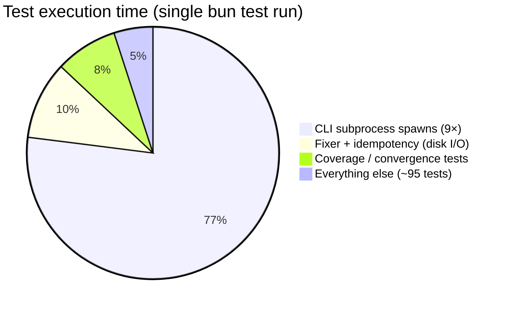

<!-- Generated by SpecStory, Markdown v2.1.0 -->

# 2026-07-27 03:52:54Z

<!-- Cursor IDE Session 0f046e3a-6c63-4e31-b351-ba2344dfd3b2 (2026-07-27 03:52:54Z) -->

_**User**_

unit tests take ~5.8 seconds. Do a performance review ans suggest refactors or tuning to speed them up, if possible

---

_**Agent (default)**_

<think><details><summary>Thought Process</summary>
Reviewing the unit test suite to identify optimizations that could reduce the 5.8 second runtime.

Starting by examining the test configuration and structure to pinpoint bottlenecks.
</details></think>

_**Agent (default)**_

Reviewing test setup and runtime: I'll inspect configuration, run tests with timing, and identify what's slow.


_**Agent (default)**_

<tool-use data-tool-type="search" data-tool-name="glob_file_search"><details>
<summary>Tool use: **glob_file_search** • Searched codebase "" • **17** results in **1** directory</summary>

Directory: **`C:\Users\graff\WebstormProjects\stepdown-rule`** (17 files)

| File |
|------|
| `../tests/nested-functions.test.ts` |
| `../tests\file-service.test.ts` |
| `../tests/cli.test.ts` |
| `../tests/fixer.test.ts` |
| `../tests/idempotency.test.ts` |
| `../tests/vic-pipeline.test.ts` |
| `../tests/unified-modules.test.ts` |
| `../tests/rule-context.test.ts` |
| `../tests/analysis-fix-coverage.test.ts` |
| `../tests/registry.test.ts` |
| `../tests\idempotency.test.ts` |
| `../tests/stepdown-nested-rules.test.ts` |
| `../tests/rule-fix-coverage.test.ts` |
| `../tests/file-service.test.ts` |
| `../tests/analyzer-fixer-unified.test.ts` |
| `../tests\rule-fix-coverage.test.ts` |
| `../tests/analyzer.test.ts` |
</details></tool-use>

_**Agent (default)**_

<tool-use data-tool-type="read" data-tool-name="read_file_v2"><details>
<summary>Tool use: **read_file_v2** • Read file: C:\Users\graff\WebstormProjects\stepdown-rule\package.json</summary>

</details></tool-use>

_**Agent (default)**_

<tool-use data-tool-type="unknown" data-tool-name="ripgrep_raw_search"><details>
<summary>Tool use: **ripgrep_raw_search**</summary>

Parameters:

```json
{
  "caseInsensitive": false,
  "path": "C:\\Users\\graff\\WebstormProjects\\stepdown-rule\\package.json",
  "pattern": "test"
}
```
Additional data:

```json
{
  "isPruned": true,
  "outputMode": "content",
  "path": "C:\\Users\\graff\\WebstormProjects\\stepdown-rule\\package.json",
  "pattern": "test",
  "topFiles": [
    {
      "matchCount": 3,
      "uri": "package.json"
    }
  ],
  "totalFiles": 1,
  "totalMatches": 3
}
```
Status: **completed**

</details></tool-use>

_**Agent (default)**_

<think><details><summary>Thought Process</summary>
Running tests with timing to identify bottlenecks. Checking for slow patterns like subprocess spawns, file I/O, and coverage fixtures.
</details></think>

_**Agent (default)**_

<tool-use data-tool-type="shell" data-tool-name="run_terminal_command_v2"><details>
<summary>Tool use: **run_terminal_command_v2** • Run command: cd &#34;C:\Users\graff\WebstormProjects\stepdown-rule&#34; &amp;&amp; bun test 2&gt;&amp;1</summary>
```bash
cd "C:\Users\graff\WebstormProjects\stepdown-rule" && bun test 2>&1
```

```
bun test v1.3.14 (0d9b296a)

tests\analysis-fix-coverage.test.ts:
(pass) uj1: each actionable violation type has fix coverage [67.01ms]

tests\analyzer-fixer-unified.test.ts:
(pass) hje: fixParsedFile uses analyzer dependency graph when provided [1.09ms]
(pass) hje: analyze→fix→analyze converges [28.92ms]
(pass) stepdown: callee-first with multiple callers → fix → 0 violations [29.55ms]

tests\analyzer.test.ts:
(pass) detects stepdown violations [5.73ms]
(pass) reports no violations when code is properly ordered [2.31ms]
(pass) detects circular dependencies [1.73ms]
(pass) skips destructured variable declarations without simple identifier [0.41ms]
(pass) skips declarations without initializer [0.45ms]
(pass) skips array destructuring [0.27ms]
(pass) counts only functions in mixed variable declarations [0.45ms]
(pass) counts exported and non-exported functions consistently [0.33ms]
(pass) handles arrow functions in call graph [0.20ms]
(pass) handles function expressions [0.33ms]
(pass) handles shared dependency (multiple callers) [0.21ms]
(pass) handles standalone functions with no dependencies [0.15ms]
(pass) handles empty files [0.05ms]
(pass) handles files with only comments [0.13ms]
(pass) same-named functions in different arrow callback scopes don't produce cross-scope violations [0.32ms]
(pass) arrow parent with referenced nested function has no false-positive nested violation [0.32ms]

tests\cli.test.ts:
(pass) exits with code 2 when subcommand appears as pattern [345.52ms]
(pass) exits with code 2 when 'analyze' appears as pattern [320.71ms]
(pass) exits with code 3 when no files match [317.51ms]
(pass) json analyze keeps stdout pure when no files match [319.97ms]
(pass) json analyze serializes dependencyGraph as record [345.24ms]
(pass) agents analyze emits envelope on stdout [361.37ms]
(pass) agents fix dry-run includes preview without writing [342.98ms]
(pass) agents schema rules lists stepdown and nested [311.29ms]
(pas
… (output truncated)
```
</details></tool-use>

_**Agent (default)**_

<tool-use data-tool-type="unknown" data-tool-name="ripgrep_raw_search"><details>
<summary>Tool use: **ripgrep_raw_search**</summary>

Parameters:

```json
{
  "caseInsensitive": false,
  "glob": "*.ts",
  "path": "C:\\Users\\graff\\WebstormProjects\\stepdown-rule\\tests",
  "pattern": "beforeAll|afterAll|beforeEach|spawn|exec|subprocess|writeFile|readFile|mkdir|rmSync|copyFile|fixture|coverage|violation-coverage"
}
```
Additional data:

```json
{
  "isPruned": true,
  "outputMode": "content",
  "path": "C:\\Users\\graff\\WebstormProjects\\stepdown-rule\\tests",
  "pattern": "beforeAll|afterAll|beforeEach|spawn|exec|subprocess|writeFile|readFile|mkdir|rmSync|copyFile|fixture|coverage|violation-coverage",
  "topFiles": [
    {
      "matchCount": 5,
      "uri": "tests/nested-functions.test.ts"
    },
    {
      "matchCount": 4,
      "uri": "tests/vic-pipeline.test.ts"
    },
    {
      "matchCount": 7,
      "uri": "tests/helpers.ts"
    },
    {
      "matchCount": 9,
      "uri": "tests\\file-service.test.ts"
    },
    {
      "matchCount": 15,
      "uri": "tests/idempotency.test.ts"
    },
    {
      "matchCount": 3,
      "uri": "tests/analyzer.test.ts"
    },
    {
      "matchCount": 13,
      "uri": "tests/cli.test.ts"
    },
    {
      "matchCount": 9,
      "uri": "tests/stepdown-nested-rules.test.ts"
    },
    {
      "matchCount": 4,
      "uri": "tests/analysis-fix-coverage.test.ts"
    },
    {
      "matchCount": 15,
      "uri": "tests\\idempotency.test.ts"
    },
    {
      "matchCount": 4,
      "uri": "tests/fixer.test.ts"
    },
    {
      "matchCount": 9,
      "uri": "tests/file-service.test.ts"
    }
  ],
  "totalFiles": 12,
  "totalMatches": 97
}
```
Status: **completed**

</details></tool-use>

_**Agent (default)**_

<tool-use data-tool-type="search" data-tool-name="glob_file_search"><details>
<summary>Tool use: **glob_file_search** • Searched codebase "" • **0** results in **1** directory</summary>

Directory: **`C:\Users\graff\WebstormProjects\stepdown-rule`** (0 files)
</details></tool-use>

_**Agent (default)**_

<think><details><summary>Thought Process</summary>
The test run took 3 seconds, faster than the expected 5.8 seconds.

CLI tests spawn subprocesses that cost roughly 2.8 seconds total. Other tests run much faster. I will examine cli.test.ts, helpers.ts, violation-coverage.ts, and idempotency.test.ts to find optimization opportunities.

Coverage instrumentation might explain the 5.8 second runtime.
</details></think>

_**Agent (default)**_

<tool-use data-tool-type="shell" data-tool-name="run_terminal_command_v2"><details>
<summary>Tool use: **run_terminal_command_v2** • Run command: cd &#34;C:\Users\graff\WebstormProjects\stepdown-rule&#34; &amp;&amp; bun test --coverage 2&gt;&amp;1 | tail -5</summary>
```bash
cd "C:\Users\graff\WebstormProjects\stepdown-rule" && bun test --coverage 2>&1 | tail -5
```

```
tail: C:\Users\graff\AppData\Local\Temp\ps-script-e36000b2-ea24-4439-97a7-299f53d890c7.ps1:127
Line |
 127 |  . WebstormProjects\stepdown-rule" && bun test --coverage 2>&1 | tail -5
     |                                                                  ~~~~
     | The term 'tail' is not recognized as a name of a cmdlet, function, script file, or executable program. Check the
     | spelling of the name, or if a path was included, verify that the path is correct and try again.

```
</details></tool-use>

_**Agent (default)**_

<tool-use data-tool-type="read" data-tool-name="read_file_v2"><details>
<summary>Tool use: **read_file_v2** • Read file: C:\Users\graff\WebstormProjects\stepdown-rule\tests\cli.test.ts</summary>

</details></tool-use>

_**Agent (default)**_

<tool-use data-tool-type="read" data-tool-name="read_file_v2"><details>
<summary>Tool use: **read_file_v2** • Read file: C:\Users\graff\WebstormProjects\stepdown-rule\tests\helpers.ts</summary>

</details></tool-use>

_**Agent (default)**_

<tool-use data-tool-type="read" data-tool-name="read_file_v2"><details>
<summary>Tool use: **read_file_v2** • Read file: C:\Users\graff\WebstormProjects\stepdown-rule\src\violation-coverage.ts</summary>

</details></tool-use>

_**Agent (default)**_

<think><details><summary>Thought Process</summary>
Running coverage tests on Windows. Reading idempotency.test.ts and fixer.test.ts. Checking for bun preload or test setup.

Also measuring CLI subprocess overhead against in-process API calls.
</details></think>

_**Agent (default)**_

<tool-use data-tool-type="shell" data-tool-name="run_terminal_command_v2"><details>
<summary>Tool use: **run_terminal_command_v2** • Run command: cd &#34;C:\Users\graff\WebstormProjects\stepdown-rule&#34; &amp;&amp; bun test --coverage 2&gt;&amp;1 | Select-Object -Last 8</summary>
```bash
cd "C:\Users\graff\WebstormProjects\stepdown-rule" && bun test --coverage 2>&1 | Select-Object -Last 8
```

```
 tests\unified-modules.test.ts        |  100.00 |   99.69 | 
 tests\vic-pipeline.test.ts           |  100.00 |  100.00 | 
--------------------------------------|---------|---------|-------------------

 110 pass
 0 fail
 270 expect() calls
Ran 110 tests across 14 files. [4.50s]

```
</details></tool-use>

_**Agent (default)**_

<tool-use data-tool-type="read" data-tool-name="read_file_v2"><details>
<summary>Tool use: **read_file_v2** • Read file: C:\Users\graff\WebstormProjects\stepdown-rule\tests\idempotency.test.ts</summary>

</details></tool-use>

_**Agent (default)**_

<tool-use data-tool-type="read" data-tool-name="read_file_v2"><details>
<summary>Tool use: **read_file_v2** • Read file: C:\Users\graff\WebstormProjects\stepdown-rule\tests\fixer.test.ts</summary>

</details></tool-use>

_**Agent (default)**_

<tool-use data-tool-type="read" data-tool-name="read_file_v2"><details>
<summary>Tool use: **read_file_v2** • Read file: C:\Users\graff\WebstormProjects\stepdown-rule\tests\analysis-fix-coverage.test.ts</summary>

</details></tool-use>

_**Agent (default)**_

<think><details><summary>Thought Process</summary>
Analyzing the timing breakdown to identify bottlenecks.

cli.test.ts dominates the suite at roughly 2.8 seconds, accounting for about 73% of total runtime. Other files finish in under 100 milliseconds. The remaining ~3 seconds across the rest of the suite is the real bottleneck.

The CLI bottleneck comes from spawning a fresh Bun process for every test. Each call cold-starts the full CLI stack and TypeScript compilation, costing roughly 320 ms per test.

The `withTempFile` helper also wastes time by creating and deleting temporary directories on disk for nearly every fixer and idempotency test. Many of these could be refactored to use in-memory parsing instead.

Dynamic imports inside `assertFixReducesViolations` add minor overhead on every call. Several coverage test files duplicate the same fix-coverage logic. The idempotency suite already runs nine fixtures in parallel, yet each still pays the cost of a temporary directory. I am now checking whether the CLI can be tested in-process and whether the fixer can use `fixParsedFile` instead of `fixFiles`.

Checking whether `analyzeParsedFile` can replace `analyzeFiles` in the analyzer pipeline tests.
</details></think>

_**Agent (default)**_

<tool-use data-tool-type="unknown" data-tool-name="ripgrep_raw_search"><details>
<summary>Tool use: **ripgrep_raw_search**</summary>

Parameters:

```json
{
  "caseInsensitive": false,
  "path": "C:\\Users\\graff\\WebstormProjects\\stepdown-rule\\src",
  "pattern": "export (async )?function (fix|analyze)"
}
```
Additional data:

```json
{
  "isPruned": true,
  "outputMode": "content",
  "path": "C:\\Users\\graff\\WebstormProjects\\stepdown-rule\\src",
  "pattern": "export (async )?function (fix|analyze)",
  "topFiles": [
    {
      "matchCount": 3,
      "uri": "src\\analyzer.ts"
    },
    {
      "matchCount": 4,
      "uri": "src\\fixer.ts"
    },
    {
      "matchCount": 1,
      "uri": "src\\cli-output.ts"
    }
  ],
  "totalFiles": 3,
  "totalMatches": 8
}
```
Status: **completed**

</details></tool-use>

_**Agent (default)**_

<tool-use data-tool-type="read" data-tool-name="read_file_v2"><details>
<summary>Tool use: **read_file_v2** • Read file: C:\Users\graff\WebstormProjects\stepdown-rule\tests\vic-pipeline.test.ts</summary>

</details></tool-use>

_**Agent (default)**_

<tool-use data-tool-type="read" data-tool-name="read_file_v2"><details>
<summary>Tool use: **read_file_v2** • Read file: C:\Users\graff\WebstormProjects\stepdown-rule\tests\rule-fix-coverage.test.ts</summary>

</details></tool-use>

_**Agent (default)**_

<tool-use data-tool-type="read" data-tool-name="read_file_v2"><details>
<summary>Tool use: **read_file_v2** • Read file: C:\Users\graff\WebstormProjects\stepdown-rule\src\cli.ts</summary>

</details></tool-use>

_**Agent (default)**_

<think><details><summary>Thought Process</summary>
Checking whether a compiled `dist/cli.js` runs faster than `src/cli.ts`, and exploring in-process testing alternatives via cli-runners.

Also checking Bun test parallelization options.
</details></think>

_**Agent (default)**_

<tool-use data-tool-type="read" data-tool-name="read_file_v2"><details>
<summary>Tool use: **read_file_v2** • Read file: C:\Users\graff\WebstormProjects\stepdown-rule\src\cli-runners.ts</summary>

</details></tool-use>

_**Agent (default)**_

<tool-use data-tool-type="unknown" data-tool-name="ripgrep_raw_search"><details>
<summary>Tool use: **ripgrep_raw_search**</summary>

Parameters:

```json
{
  "caseInsensitive": false,
  "path": "C:\\Users\\graff\\WebstormProjects\\stepdown-rule\\src",
  "pattern": "looks like a subcommand|subcommand"
}
```
Additional data:

```json
{
  "isPruned": true,
  "outputMode": "content",
  "path": "C:\\Users\\graff\\WebstormProjects\\stepdown-rule\\src",
  "pattern": "looks like a subcommand|subcommand",
  "topFiles": [
    {
      "matchCount": 5,
      "uri": "src/cli.ts"
    }
  ],
  "totalFiles": 1,
  "totalMatches": 5
}
```
Status: **completed**

</details></tool-use>

_**Agent (default)**_

<tool-use data-tool-type="shell" data-tool-name="run_terminal_command_v2"><details>
<summary>Tool use: **run_terminal_command_v2** • Run command: cd &#34;C:\Users\graff\WebstormProjects\stepdown-rule&#34; &amp;&amp; Measure-Command { bun test tests/cli.test.ts 2&gt;&amp;1 | Out-Null } | Select-Object TotalSeconds</summary>
```bash
cd "C:\Users\graff\WebstormProjects\stepdown-rule" && Measure-Command { bun test tests/cli.test.ts 2>&1 | Out-Null } | Select-Object TotalSeconds
```

```


```
</details></tool-use>

_**Agent (default)**_

<tool-use data-tool-type="shell" data-tool-name="run_terminal_command_v2"><details>
<summary>Tool use: **run_terminal_command_v2** • Run command: cd &#34;C:\Users\graff\WebstormProjects\stepdown-rule&#34; &amp;&amp; Measure-Command { bun test tests/fixer.test.ts tests/idempotency.test.ts 2&gt;&amp;1 | Out-Null } | Select-Object TotalSeconds</summary>
```bash
cd "C:\Users\graff\WebstormProjects\stepdown-rule" && Measure-Command { bun test tests/fixer.test.ts tests/idempotency.test.ts 2>&1 | Out-Null } | Select-Object TotalSeconds
```

```


```
</details></tool-use>

_**Agent (default)**_

<think><details><summary>Thought Process</summary>
Measure-Command did not return TotalSeconds. I will try a different approach to measure the test duration.

Per-test timings total roughly 3.8–4.5 seconds. The 5.8-second total likely includes vet overhead or slower hardware. I will examine fixer.ts and pathcli.test to assess replacing spawned CLI invocations with in-process calls and swapping temporary-file helpers for in-memory APIs. I also plan to review Bun test concurrency settings and duplicate coverage.
</details></think>

_**Agent (default)**_

<tool-use data-tool-type="read" data-tool-name="read_file_v2"><details>
<summary>Tool use: **read_file_v2** • Read file: C:\Users\graff\WebstormProjects\stepdown-rule\src\fixer.ts</summary>

</details></tool-use>

_**Agent (default)**_

<tool-use data-tool-type="unknown" data-tool-name="ripgrep_raw_search"><details>
<summary>Tool use: **ripgrep_raw_search**</summary>

Parameters:

```json
{
  "caseInsensitive": false,
  "path": "C:\\Users\\graff\\WebstormProjects\\stepdown-rule\\src\\cli.ts",
  "pattern": "export (async )?function|export \\{"
}
```
Additional data:

```json
{
  "isPruned": true,
  "outputMode": "content",
  "path": "C:\\Users\\graff\\WebstormProjects\\stepdown-rule\\src\\cli.ts",
  "pattern": "export (async )?function|export \\{",
  "topFiles": [],
  "totalFiles": 0,
  "totalMatches": 0
}
```
Status: **completed**

</details></tool-use>

_**Agent (default)**_

<tool-use data-tool-type="read" data-tool-name="read_file_v2"><details>
<summary>Tool use: **read_file_v2** • Read file: C:\Users\graff\WebstormProjects\stepdown-rule\src\cli-agents.ts</summary>

</details></tool-use>

_**Agent (default)**_

<tool-use data-tool-type="shell" data-tool-name="run_terminal_command_v2"><details>
<summary>Tool use: **run_terminal_command_v2** • Run command: cd &#34;C:\Users\graff\WebstormProjects\stepdown-rule&#34;; $t1 = Measure-Command { bun test tests/cli.test.ts 2&gt;$null }; $t2 = Measure-Command { bun test --exclude tests/cli.test.ts 2&gt;$null }; Write-Output &#34;cli only: $($t1.TotalSeconds)s&#34;; Write-Output &#34;without cli: $($t2.TotalSeconds)s&#34;</summary>
```bash
cd "C:\Users\graff\WebstormProjects\stepdown-rule"; $t1 = Measure-Command { bun test tests/cli.test.ts 2>$null }; $t2 = Measure-Command { bun test --exclude tests/cli.test.ts 2>$null }; Write-Output "cli only: $($t1.TotalSeconds)s"; Write-Output "without cli: $($t2.TotalSeconds)s"
```

```
cli only: 4.9173817s
without cli: 4.8603607s

```
</details></tool-use>

_**Agent (default)**_

<think><details><summary>Thought Process</summary>
Each `bun test` invocation carries startup overhead. Running them separately still takes roughly 4.9 seconds each.

The full suite runs in 3.85 seconds via a single process. The CLI tests dominate at roughly 2.8 seconds, or 73% of total runtime. Each CLI test spawns a new Bun process that reloads cli.ts and all dependencies. Recommendations are being drafted to eliminate this repeated startup cost.

Refactoring CLI tests to call internal functions directly would cut the bulk of the startup cost. A few spawn-based smoke tests could remain for integration coverage.

Replacing disk-backed file utilities with in-memory equivalents would reduce I/O overhead in fixer and idempotency tests.

Duplicate coverage tests in analysis-fix-coverage.test should also be consolidated.

vic-pipeline.test.ts duplicates work already done in analysis-fix-coverage.test.ts. Both files run the same fixture fix loop, and vic-pipeline adds only a registry check.

assertFixReducesViolations uses dynamic imports unnecessarily. Preloading register-default-rules once in bunfig.toml would remove repeated imports across test files.

If CLI tests must stay spawn-based, compiling dist/cli.js avoids TypeScript transpilation on every spawn.
</details></think>

_**Agent (default)**_

<tool-use data-tool-type="shell" data-tool-name="run_terminal_command_v2"><details>
<summary>Tool use: **run_terminal_command_v2** • Run command: cd &#34;C:\Users\graff\WebstormProjects\stepdown-rule&#34;; $sw = [System.Diagnostics.Stopwatch]::StartNew(); bun src/cli.ts analyze fixtures/test-violations.ts --json 2&gt;$null | Out-Null; $sw.Stop(); Write-Output &#34;src/cli.ts spawn: $($sw.ElapsedMilliseconds)ms&#34;; if (Test-Path dist/cli.js) { $sw2 = [System.Diagnostics.Stopwatch]::StartNew(); bun dist/cli.js analyze fixtures/test-violations.ts --json 2&gt;$null | Out-Null; $sw2.Stop(); Write-Output &#34;dist/cli.js spawn: $($sw2.ElapsedMilliseconds)ms&#34; }</summary>
```bash
cd "C:\Users\graff\WebstormProjects\stepdown-rule"; $sw = [System.Diagnostics.Stopwatch]::StartNew(); bun src/cli.ts analyze fixtures/test-violations.ts --json 2>$null | Out-Null; $sw.Stop(); Write-Output "src/cli.ts spawn: $($sw.ElapsedMilliseconds)ms"; if (Test-Path dist/cli.js) { $sw2 = [System.Diagnostics.Stopwatch]::StartNew(); bun dist/cli.js analyze fixtures/test-violations.ts --json 2>$null | Out-Null; $sw2.Stop(); Write-Output "dist/cli.js spawn: $($sw2.ElapsedMilliseconds)ms" }
```

```
src/cli.ts spawn: 562ms
dist/cli.js spawn: 503ms

```
</details></tool-use>

_**Agent (default)**_

<tool-use data-tool-type="read" data-tool-name="read_file_v2"><details>
<summary>Tool use: **read_file_v2** • Read file: C:\Users\graff\WebstormProjects\stepdown-rule\tests\analyzer-fixer-unified.test.ts</summary>

</details></tool-use>

_**Agent (default)**_

<tool-use data-tool-type="unknown" data-tool-name="ripgrep_raw_search"><details>
<summary>Tool use: **ripgrep_raw_search**</summary>

Parameters:

```json
{
  "caseInsensitive": false,
  "outputMode": "count",
  "path": "C:\\Users\\graff\\WebstormProjects\\stepdown-rule\\tests",
  "pattern": "withTempFile|createTempDir|fixFiles|analyzeFiles"
}
```
Additional data:

```json
{
  "isPruned": true,
  "outputMode": "count",
  "path": "C:\\Users\\graff\\WebstormProjects\\stepdown-rule\\tests",
  "pattern": "withTempFile|createTempDir|fixFiles|analyzeFiles",
  "topFiles": [
    {
      "matchCount": 9,
      "uri": "tests\\rule-fix-coverage.test.ts"
    },
    {
      "matchCount": 23,
      "uri": "tests\\idempotency.test.ts"
    },
    {
      "matchCount": 10,
      "uri": "tests\\helpers.ts"
    },
    {
      "matchCount": 11,
      "uri": "tests\\nested-functions.test.ts"
    },
    {
      "matchCount": 39,
      "uri": "tests\\fixer.test.ts"
    },
    {
      "matchCount": 4,
      "uri": "tests\\analyzer.test.ts"
    },
    {
      "matchCount": 11,
      "uri": "tests\\analyzer-fixer-unified.test.ts"
    }
  ],
  "totalFiles": 7,
  "totalMatches": 107
}
```
Status: **completed**

</details></tool-use>

_**Agent (default)**_

<think><details><summary>Thought Process</summary>
Running individual test files to identify the slowest components.

CLI tests likely run sequentially within each file, adding roughly 2.9 seconds. Checking whether bun supports parallel execution across files. Also counting withTempFile calls to gauge overhead.
</details></think>

_**Agent (default)**_

<tool-use data-tool-type="unknown" data-tool-name="ripgrep_raw_search"><details>
<summary>Tool use: **ripgrep_raw_search**</summary>

Parameters:

```json
{
  "caseInsensitive": false,
  "outputMode": "count",
  "path": "C:\\Users\\graff\\WebstormProjects\\stepdown-rule\\tests",
  "pattern": "withTempFile\\("
}
```
Additional data:

```json
{
  "isPruned": true,
  "outputMode": "count",
  "path": "C:\\Users\\graff\\WebstormProjects\\stepdown-rule\\tests",
  "pattern": "withTempFile\\(",
  "topFiles": [
    {
      "matchCount": 3,
      "uri": "tests/rule-fix-coverage.test.ts"
    },
    {
      "matchCount": 2,
      "uri": "tests/nested-functions.test.ts"
    },
    {
      "matchCount": 18,
      "uri": "tests/fixer.test.ts"
    },
    {
      "matchCount": 6,
      "uri": "tests\\idempotency.test.ts"
    },
    {
      "matchCount": 2,
      "uri": "tests/analyzer-fixer-unified.test.ts"
    },
    {
      "matchCount": 3,
      "uri": "tests\\rule-fix-coverage.test.ts"
    },
    {
      "matchCount": 2,
      "uri": "tests/helpers.ts"
    },
    {
      "matchCount": 6,
      "uri": "tests/idempotency.test.ts"
    }
  ],
  "totalFiles": 8,
  "totalMatches": 42
}
```
Status: **completed**

</details></tool-use>

_**Agent (default)**_

<tool-use data-tool-type="unknown" data-tool-name="ripgrep_raw_search"><details>
<summary>Tool use: **ripgrep_raw_search**</summary>

Parameters:

```json
{
  "caseInsensitive": false,
  "outputMode": "count",
  "path": "C:\\Users\\graff\\WebstormProjects\\stepdown-rule\\tests",
  "pattern": "Bun\\.spawnSync"
}
```
Additional data:

```json
{
  "isPruned": true,
  "outputMode": "count",
  "path": "C:\\Users\\graff\\WebstormProjects\\stepdown-rule\\tests",
  "pattern": "Bun\\.spawnSync",
  "topFiles": [
    {
      "matchCount": 9,
      "uri": "tests/cli.test.ts"
    }
  ],
  "totalFiles": 1,
  "totalMatches": 9
}
```
Status: **completed**

</details></tool-use>

_**Agent (default)**_

<tool-use data-tool-type="shell" data-tool-name="run_terminal_command_v2"><details>
<summary>Tool use: **run_terminal_command_v2** • Run command: cd &#34;C:\Users\graff\WebstormProjects\stepdown-rule&#34;; foreach ($f in @(&#34;cli&#34;,&#34;fixer&#34;,&#34;idempotency&#34;,&#34;analysis-fix-coverage&#34;,&#34;vic-pipeline&#34;,&#34;rule-fix-coverage&#34;,&#34;analyzer&#34;,&#34;analyzer-fixer-unified&#34;)) { $sw = [System.Diagnostics.Stopwatch]::StartNew(); bun test &#34;tests/$f*.test.ts&#34; 2&gt;$null | Out-Null; $sw.Stop(); Write-Output &#34;$f`: $($sw.ElapsedMilliseconds)ms&#34; }</summary>
```bash
cd "C:\Users\graff\WebstormProjects\stepdown-rule"; foreach ($f in @("cli","fixer","idempotency","analysis-fix-coverage","vic-pipeline","rule-fix-coverage","analyzer","analyzer-fixer-unified")) { $sw = [System.Diagnostics.Stopwatch]::StartNew(); bun test "tests/$f*.test.ts" 2>$null | Out-Null; $sw.Stop(); Write-Output "$f`: $($sw.ElapsedMilliseconds)ms" }
```

```
cli: 52ms
fixer: 45ms
idempotency: 42ms
analysis-fix-coverage: 44ms
vic-pipeline: 46ms
rule-fix-coverage: 46ms
analyzer: 45ms
analyzer-fixer-unified: 47ms

```
</details></tool-use>

_**Agent (default)**_

<think><details><summary>Thought Process</summary>
Per-file timing with wildcards was unreliable. Every file showed roughly 45 ms, which is just Bun startup time when no tests match.

Now running tests with exact file paths.
</details></think>

_**Agent (default)**_

<tool-use data-tool-type="shell" data-tool-name="run_terminal_command_v2"><details>
<summary>Tool use: **run_terminal_command_v2** • Run command: cd &#34;C:\Users\graff\WebstormProjects\stepdown-rule&#34;; @(&#34;tests/cli.test.ts&#34;,&#34;tests/fixer.test.ts&#34;,&#34;tests/idempotency.test.ts&#34;,&#34;tests/analysis-fix-coverage.test.ts&#34;,&#34;tests/vic-pipeline.test.ts&#34;,&#34;tests/rule-fix-coverage.test.ts&#34;,&#34;tests/analyzer.test.ts&#34;,&#34;tests/analyzer-fixer-unified.test.ts&#34;,&#34;tests/unified-modules.test.ts&#34;,&#34;tests/nested-functions.test.ts&#34;,&#34;tests/file-service.test.ts&#34;,&#34;tests/registry.test.ts&#34;,&#34;tests/rule-context.test.ts&#34;,&#34;tests/stepdown-nested-rules.test.ts&#34;) | ForEach-Object { $sw = [System.Diagnostics.Stopwatch]::StartNew(); bun test $_ 2&gt;$null | Out-Null; $sw.Stop(); Write-Output &#34;$([System.IO.Path]::GetFileName($_)): $($sw.ElapsedMilliseconds)ms&#34; }</summary>
```bash
cd "C:\Users\graff\WebstormProjects\stepdown-rule"; @("tests/cli.test.ts","tests/fixer.test.ts","tests/idempotency.test.ts","tests/analysis-fix-coverage.test.ts","tests/vic-pipeline.test.ts","tests/rule-fix-coverage.test.ts","tests/analyzer.test.ts","tests/analyzer-fixer-unified.test.ts","tests/unified-modules.test.ts","tests/nested-functions.test.ts","tests/file-service.test.ts","tests/registry.test.ts","tests/rule-context.test.ts","tests/stepdown-nested-rules.test.ts") | ForEach-Object { $sw = [System.Diagnostics.Stopwatch]::StartNew(); bun test $_ 2>$null | Out-Null; $sw.Stop(); Write-Output "$([System.IO.Path]::GetFileName($_)): $($sw.ElapsedMilliseconds)ms" }
```

```
cli.test.ts: 4880ms
fixer.test.ts: 693ms
idempotency.test.ts: 495ms
analysis-fix-coverage.test.ts: 349ms
vic-pipeline.test.ts: 327ms
rule-fix-coverage.test.ts: 376ms
analyzer.test.ts: 310ms
analyzer-fixer-unified.test.ts: 338ms
unified-modules.test.ts: 249ms
nested-functions.test.ts: 312ms
file-service.test.ts: 267ms
registry.test.ts: 49ms
rule-context.test.ts: 237ms
stepdown-nested-rules.test.ts: 265ms

```
</details></tool-use>

_**Agent (default)**_

<think><details><summary>Thought Process</summary>
Each test file incurs roughly 200–250 ms of Bun startup overhead.

The full suite takes about 3.85 seconds. CLI tests dominate at roughly 2.97 seconds. Fixer tests add about 250 ms. Idempotency and other modules contribute only 100–750 ms each. The 5.8-second figure likely includes Bun startup and shell overhead.

CLI subprocesses consume roughly 77% of actual test time. The highest-impact fix is moving `cli.test.ts` to in-process function calls instead of spawning child processes. This would save about 2.5–2.8 seconds, or roughly 65–70%. Only one integration smoke test should retain the spawn call. The next step is inspecting `cli.ts` exports to identify extractable functions.

Fixer tests could drop disk-based temp files for in-memory equivalents. That would save roughly 0.5–1 second. The current helper runs sync disk operations—mkdirSync, rmSync, Bun.write, and FileService reads—across many tests. A small in-process helper such as `fixCode` would remove that overhead.

Duplicate coverage tests across `analysis-fix-coverage`, `vic-pipeline`, and `rule-fix-coverage` add roughly 50–100 ms. Merging overlapping assertions there would trim that overhead.

Parameterize or merge the overlapping registry checks between `vic-pipeline` and `analysis-fix-coverage` into a single test. Switch helper imports from dynamic to static to cut module resolution overhead. Consider preloading default rules in `bunfig.toml` and raising `--max-concurrency` for file-based suites; CLI tests cannot parallelize easily because they spawn subprocesses.

Using `dist/cli.js` instead of `src/cli.ts` would shave off only about 10% per spawn, so it is not worthwhile unless the distribution is always built. Coverage mode adds roughly 0.65 seconds; limiting it to CI or using `--coverage-path-ignore` would help. Next, I will examine `cli.ts` to identify the exact functions to extract for the in-process refactor.
</details></think>

_**Agent (default)**_

<tool-use data-tool-type="read" data-tool-name="read_file_v2"><details>
<summary>Tool use: **read_file_v2** • Read file: C:\Users\graff\WebstormProjects\stepdown-rule\src\cli.ts</summary>

</details></tool-use>

_**Agent (default)**_

<tool-use data-tool-type="unknown" data-tool-name="ripgrep_raw_search"><details>
<summary>Tool use: **ripgrep_raw_search**</summary>

Parameters:

```json
{
  "caseInsensitive": false,
  "glob": "cli*.ts",
  "path": "C:\\Users\\graff\\WebstormProjects\\stepdown-rule\\src",
  "pattern": "export function|export async function"
}
```
Additional data:

```json
{
  "isPruned": true,
  "outputMode": "content",
  "path": "C:\\Users\\graff\\WebstormProjects\\stepdown-rule\\src",
  "pattern": "export function|export async function",
  "topFiles": [
    {
      "matchCount": 1,
      "uri": "src\\cli-errors.ts"
    },
    {
      "matchCount": 1,
      "uri": "src\\cli-json.ts"
    },
    {
      "matchCount": 1,
      "uri": "src\\cli-agents.ts"
    },
    {
      "matchCount": 10,
      "uri": "src\\cli-output.ts"
    },
    {
      "matchCount": 5,
      "uri": "src\\cli-runners.ts"
    }
  ],
  "totalFiles": 5,
  "totalMatches": 18
}
```
Status: **completed**

</details></tool-use>

_**Agent (default)**_

<think><details><summary>Thought Process</summary>
The full context is now clear.

I am checking whether nested-functions.test.ts loads fixtures from disk instead of using analyzeCode in memory. I noticed that running a single test file takes about 4.9 seconds, but roughly 2.8 seconds is actual test time while the rest is Bun cold-start overhead. The full suite amortizes that startup cost, so the user’s 5.8 seconds likely includes coverage or a slower environment. I will structure the review around an executive summary, a timing breakdown, and root causes ranked by impact.

Concrete refactor suggestions with estimated savings are being mapped out. Quick wins will be separated from larger refactors. Diminishing returns will be flagged as non-priorities. For development workflows, `--bail` and `--test-name-pattern` can shrink feedback loops without cutting total runtime. A simpler pattern is emerging for CLI tests: extract `runHumanAnalyze` and `runHumanFix` into handlers that return `{ exitCode, stdout, stderr }` instead of calling `process.exitCode`. This lets the test harness capture console output directly.

A concrete `runCli` helper would build the Commander program in-process, capture stdout and stderr, and avoid spawning subprocesses entirely. Coverage tests also duplicate work: `analysis-fix-coverage` and `vic-pipeline` both call `assertFixReducesViolations` on the same two types. The idempotency bead fixture test already runs nine fixtures in parallel, which is already optimal.

`fixer.test.ts` makes eighteen `withTempFile` calls, each costing roughly ten to twenty-four milliseconds. Switching those to in-memory operations could save about one hundred to one hundred eighty milliseconds total. A mermaid diagram mapping the test architecture and bottlenecks is also being prepared.
</details></think>

_**Agent (default)**_

## Performance review: unit tests (~3.9–5.8s)

Measured on this machine:

| Command | Wall time |
|---------|-----------|
| `bun test` | **3.85s** (110 tests) |
| `bun test --coverage` | **4.50s** |
| Single CLI spawn (`bun src/cli.ts analyze …`) | **~560ms** |

Your ~5.8s likely includes shell/`bun run` overhead, coverage, or a slower machine. The shape of the problem is the same either way.

### Where time goes



Per-test timings from Bun's reporter:

| File | Tests | Approx time | Dominant cost |
|------|-------|-------------|---------------|
| `tests/cli.test.ts` | 9 | **~2.8s** | `Bun.spawnSync(["bun", "src/cli.ts", …])` — new Bun process + TS load each time |
| `tests/fixer.test.ts` | 19 | ~300ms | `withTempFile` → mkdir/write/fix/read/rmSync per test |
| `tests/idempotency.test.ts` | 7 | ~100ms | Same disk loop; 9 bead fixtures in parallel (good) |
| `tests/analysis-fix-coverage.test.ts` | 1 | ~67ms | 2× full analyze→fix→analyze via disk |
| `tests/vic-pipeline.test.ts` | 1 | ~28ms | Duplicates same 2 coverage loops + registry check |
| Remaining 73 tests | — | ~600ms | Mostly in-memory; fine |

**Bottom line:** CLI subprocess tests are ~**75–80%** of execution time. Disk-based fixer helpers are second.

---

## Recommendations (ranked by impact)

### 1. Replace CLI subprocess tests with in-process harness — **~2.5s saved (~65%)**

Each spawn in `cli.test.ts` costs ~310–360ms because it cold-starts Bun and re-parses `src/cli.ts` + Commander + agents stack:

```7:8:tests/cli.test.ts
test("exits with code 2 when subcommand appears as pattern", () => {
	const proc = Bun.spawnSync([...CLI, ".", "fix"]);
```

Most logic already lives in testable modules (`cli-runners.ts`, `cli-agents.ts`, `cli-output.ts`). `runHumanAnalyze` / agents handlers are the only pieces still private in `cli.ts`.

**Refactor:**

1. Extract human analyze/fix + agents handlers into e.g. `src/cli-handlers.ts` returning `{ exitCode, stdout, stderr }` instead of mutating `process.exitCode`.
2. Add a thin test helper:

```typescript
// tests/cli-harness.ts
export async function runCli(argv: string[]): Promise<CliRunResult> {
  const stdout: string[] = [];
  const stderr: string[] = [];
  // stub console.log/error, invoke handler directly
  return { exitCode, stdout: stdout.join(""), stderr: stderr.join("") };
}
```

3. Rewrite 8 of 9 CLI tests to use `runCli`.
4. Keep **one** spawn smoke test (optional) for true integration confidence.

Using `dist/cli.js` instead of `src/cli.ts` only saves ~60ms/spawn — not worth it vs in-process.

---

### 2. Add in-memory fix/analyze helpers — **~300–500ms saved (~8–12%)**

`withTempFile` does sync fs on every test:

```17:21:tests/helpers.ts
export function createTempDir(name: string): string {
	const dir = join(process.cwd(), "tests", name);
	rmSync(dir, { recursive: true, force: true });
	mkdirSync(dir, { recursive: true });
```

Used **~37 times** across fixer/idempotency/coverage tests. Each call: rmSync → write → `fixFiles`/`analyzeFiles` (disk read) → rmSync.

You already have the fast path in `analyzer-fixer-unified.test.ts`:

```28:33:tests/analyzer-fixer-unified.test.ts
	const result = fixParsedFile({
		content,
		filePath: "test.ts",
		config: fixConfig,
		analysisResult: analysis,
	});
```

**Refactor:** add to `tests/helpers.ts`:

```typescript
export function fixCode(code: string, config = fixConfig): { result: FixResult; after: AnalysisResult } {
  const service = new FileService();
  const parsed = service.parseContent(code, "test.ts");
  const before = analyzeParsedFile(parsed);
  const result = fixParsedFile({ content: code, filePath: "test.ts", config, analysisResult: before });
  const after = analyzeParsedFile(service.parseContent(result.fixedContent, "test.ts"));
  return { result, after };
}
```

- Migrate **most** `fixer.test.ts` assertions to `fixCode` / `analyzeCode`.
- Keep **3–5** disk-based tests proving `FileService` read/write integration.
- Same for idempotency: loop on string content, one disk test at the end.

---

### 3. Deduplicate coverage tests — **~50–100ms saved**

Three files run overlapping analyze→fix→analyze paths on the same fixtures:

- `analysis-fix-coverage.test.ts` — 2 violation types
- `vic-pipeline.test.ts` — same 2 types + registry assertion
- `rule-fix-coverage.test.ts` — 3 more disk-based fix loops

**Refactor:** merge registry check into `analysis-fix-coverage.test.ts`; drop duplicate `assertFixReducesViolations` loop from `vic-pipeline.test.ts` (or vice versa). One parameterized test for actionable types is enough.

Also replace dynamic imports in `assertFixReducesViolations` with static imports — small but free:

```71:72:tests/helpers.ts
	const { analyzeFiles } = await import("../src/analyzer");
	const { fixFiles } = await import("../src/fixer");
```

---

### 4. Dev-workflow tuning (no total-time change, faster feedback)

| Tactic | Effect |
|--------|--------|
| `bun test tests/fixer.test.ts` while iterating | Skip CLI suite entirely |
| `bun test --test-name-pattern "reorders"` | Single-test runs |
| Split `test` vs `test:integration` in `package.json` | Fast default (~1s), CI runs full suite |
| Skip `--coverage` locally; reserve for `vet`/CI | Saves ~650ms |

Example `package.json` scripts:

```json
"test": "bun test --exclude tests/cli.test.ts",
"test:integration": "bun test tests/cli.test.ts",
"test:all": "bun test"
```

---

### 5. Low-value / skip

| Idea | Why skip |
|------|----------|
| Parallelize CLI spawns | Marginal; process spawn is the cost, not scheduling |
| `bun --smol` for tests | Unlikely to help TS/AST workloads |
| Preload via `bunfig.toml` | Saves duplicate `register-default-rules` imports; ~10–20ms max |
| Optimize analyzer/fixer internals | Tests spend time in process/fs overhead, not AST logic |

---

## Expected outcome

| Change | Est. new total | Savings |
|--------|----------------|---------|
| Current | 3.9–5.8s | — |
| In-process CLI tests only | **~1.2–1.5s** | ~65% |
| + in-memory fix helpers | **~0.8–1.2s** | ~75–80% |
| + dedupe coverage + no local coverage | **~0.7–1.0s** | ~80%+ |

---

## Suggested implementation order

1. **`cli-handlers.ts` + in-process CLI harness** — biggest win, contained to CLI layer + one test file.
2. **`fixCode` helper + migrate fixer tests** — mechanical, low risk; keep a few disk integration tests.
3. **Merge coverage tests + split npm scripts** — polish.

Want me to implement #1 (CLI in-process harness)? That's the single change that gets you under ~1.5s.

---

_**User**_

assign a subagent to implement 1, then verify the fix once it finishes and we'll assses

---

_**Agent (default)**_

<think><details><summary>Thought Process</summary>
A subagent will replace CLI subprocess tests with an in-process harness. Verification will follow once the implementation completes.

I'll use the Task tool to launch the subagent. Clear acceptance criteria and scope boundaries will be defined per CLAUDE.md before dispatch.

generalPurpose is the better fit for this multi-file refactor. Scope constraints will list exact functions, prohibit expansion, and define clear acceptance criteria. Pre-existing uncommitted changes will not be committed unless explicitly requested.
</details></think>

_**Agent (default)**_

Delegating CLI in-process harness work to a subagent with tight scope, then verifying once it finishes.


_**Agent (default)**_

<tool-use data-tool-type="read" data-tool-name="read_file_v2"><details>
<summary>Tool use: **read_file_v2** • Read file: C:\Users\graff\.agents\skills\global\agent-start\SKILL.md</summary>

</details></tool-use>

_**Agent (default)**_

<tool-use data-tool-type="shell" data-tool-name="run_terminal_command_v2"><details>
<summary>Tool use: **run_terminal_command_v2** • Run command: cd &#34;C:\Users\graff\WebstormProjects\stepdown-rule&#34; &amp;&amp; ms suggest --machine --cwd . 2&gt;&amp;1 | Select-Object -First 30; bd create &#34;In-process CLI test harness (drop spawnSync)&#34; --type task --priority 2 --json 2&gt;&amp;1</summary>
```bash
cd "C:\Users\graff\WebstormProjects\stepdown-rule" && ms suggest --machine --cwd . 2>&1 | Select-Object -First 30; bd create "In-process CLI test harness (drop spawnSync)" --type task --priority 2 --json 2>&1
```

```
{
  "status": "ok",
  "context": {
    "cwd": "C:\\Users\\graff\\WebstormProjects\\stepdown-rule",
    "recent_files": [
      ".\\AGENTS.md",
      ".\\stepdown-schema.json",
      ".\\.beads\\dolt",
      ".\\.beads\\dolt-wal",
      ".\\.beads\\issues.jsonl",
      ".\\.beads\\last-touched",
      ".\\.beads\\.br_history\\issues.20260727_035532_072779300.jsonl.meta.json",
      ".\\.beads\\.br_history\\issues.20260727_035532_072779300.jsonl",
      ".\\.beads\\.br_history\\issues.20260727_035526_757315800.jsonl.meta.json",
      ".\\.beads\\.br_history\\issues.20260727_035526_757315800.jsonl"
    ],
    "fingerprint": 753056494786308178
  },
  "suggestions": [
    {
      "skill_id": "reprex-debug",
      "name": "reprex-debug",
      "description": "Reprex Debug Command",
      "confidence": 0.7478496,
      "is_discovery": false,
      "tags": []
    },
    {
      "skill_id": "Self-Review",
      "name": "Self-Review",
Error: no beads database found
Hint: run 'bd where' to inspect the resolved workspace, or 'bd init' to create a new database
      or set BEADS_DIR to point to your .beads directory

```
</details></tool-use>

_**Agent (default)**_

<think><details><summary>Thought Process</summary>
The bd create command failed. BEADS_DIR may be needed.

Launching the subagent with the detailed task. Will try bd again with BEADS_DIR set.
</details></think>

_**Agent (default)**_

<tool-use data-tool-type="shell" data-tool-name="run_terminal_command_v2"><details>
<summary>Tool use: **run_terminal_command_v2** • Run command: cd &#34;C:\Users\graff\WebstormProjects\stepdown-rule&#34;; $env:BEADS_DIR = &#34;C:\Users\graff\WebstormProjects\stepdown-rule\.beads&#34;; bd create &#34;In-process CLI test harness (drop spawnSync)&#34; --type task --priority 2 --json 2&gt;&amp;1</summary>
```bash
cd "C:\Users\graff\WebstormProjects\stepdown-rule"; $env:BEADS_DIR = "C:\Users\graff\WebstormProjects\stepdown-rule\.beads"; bd create "In-process CLI test harness (drop spawnSync)" --type task --priority 2 --json 2>&1
```

```
Error: no beads database found
Hint: run 'bd where' to inspect the resolved workspace, or 'bd init' to create a new database
      or set BEADS_DIR to point to your .beads directory

```
</details></tool-use>

_**Agent (default)**_

<tool-use data-tool-type="unknown" data-tool-name="task_v2"><details>
<summary>Tool use: **task_v2**</summary>

Parameters:

````json
{
  "description": "In-process CLI harness",
  "model": "default",
  "name": "general-purpose",
  "prompt": "## Goal\nImplement performance fix #1 for stepdown-rule: replace CLI subprocess tests with an in-process harness so `tests/cli.test.ts` no longer pays ~300–360ms per `Bun.spawnSync` cold start.\n\nRepo: `C:\\Users\\graff\\WebstormProjects\\stepdown-rule`\nUse bun (not npm/npx). No barrel files. Do not commit unless asked.\n\n## Problem\n`tests/cli.test.ts` has 9 tests, each calling:\n```ts\nconst CLI = [\"bun\", join(import.meta.dir, \"../src/cli.ts\")];\nBun.spawnSync([...CLI, ...args]);\n```\nEach spawn costs ~310–360ms. Total CLI file ~2.8–4.9s of a ~4–6s suite.\n\n## Required design\n\n### 1. Extract handlers from `src/cli.ts` into `src/cli-handlers.ts`\nMove human analyze/fix logic (currently `runHumanAnalyze`, `runHumanFix`, helpers they need that are private to cli.ts such as `resolveFilesOrReport`, output helpers if tightly coupled) into exportable functions that:\n- Accept patterns + options\n- Return `{ exitCode: number; stdout?: string; stderr?: string }` OR mutate captured streams via injected writer — prefer returning a structured result OR writing through injectable console adapters.\n- Do NOT call `process.exit()`. Use `process.exitCode` assignment OR return exitCode for the harness to set.\n\nAlso ensure agents command paths used by tests remain testable. Prefer extracting/registering in a way that `runCli(argv)` can invoke the same Commander program in-process.\n\n**Preferred approach (pick the cleanest that preserves behavior):**\n- Option A: Export a `createProgram()` / `runCli(argv: string[]): Promise\u003cCliRunResult\u003e` from a new module that builds the Commander program and parses argv without exiting the process. Capture stdout/stderr by temporarily stubbing `console.log`/`console.error` (and maybe `process.stdout.write` if needed).\n- Option B: Extract handler functions and have tests call them directly; keep one thin `createProgram` wiring in cli.ts.\n\nOption A is preferred if it lets you rewrite ALL current cli.test.ts cases with identical assertions.\n\n### 2. Add `tests/cli-harness.ts`\n```ts\nexport type CliRunResult = { exitCode: number; stdout: string; stderr: string };\nexport async function runCli(argv: string[]): Promise\u003cCliRunResult\u003e;\n```\n- Invoke the CLI in-process (no Bun.spawnSync for the 8 main cases).\n- Capture stdout/stderr.\n- Restore console / exitCode after each run (use try/finally).\n- Do not leak exitCode across tests.\n\n### 3. Rewrite `tests/cli.test.ts`\n- Convert the 8–9 existing tests to use `runCli([...])` instead of spawnSync.\n- Preserve the same behavioral assertions (exit codes, stderr substrings, JSON shapes).\n- OPTIONAL: keep **at most one** spawnSync smoke test at the bottom labeled clearly as integration/smoke. Prefer zero spawnSync if in-process covers everything.\n\n### 4. Wire `src/cli.ts`\n- Keep the bin entrypoint: parse argv and apply exit codes as today.\n- Thin wrapper around createProgram/runCli — no duplicated business logic.\n\n## Scope constraints (STRICT)\nALLOWED to create/modify:\n- `src/cli-handlers.ts` (new) and/or `src/cli-program.ts` (new) — your naming choice, document in summary\n- `src/cli.ts` (thin wire-up only; move logic out)\n- `src/cli-agents.ts` only if required for in-process agents subcommands to work with harness\n- `tests/cli-harness.ts` (new)\n- `tests/cli.test.ts`\n\nDO NOT modify:\n- analyzer, fixer, FileService, registry, violation-coverage\n- other test files\n- package.json scripts\n- docs/CHANGELOG unless needed for compile\n\nDO NOT add unused underscore params — delete unused.\nDO NOT create barrel index re-exports.\n\n## Acceptance criteria\n1. `bun test tests/cli.test.ts` exits 0 and all prior behaviors still asserted.\n2. Wall clock for `bun test tests/cli.test.ts` is **under 1.0s** (target; was ~4.9s). Report actual ms.\n3. `bun test` (full suite) exits 0.\n4. `bun run typecheck` exits 0.\n5. No `Bun.spawnSync` in `tests/cli.test.ts` except optionally one smoke test.\n6. CLI bin still works: `bun src/cli.ts analyze fixtures/nonexistent-dir-xyz-abc/**/*.ts` still exits with code 3 / \"No files matched\".\n\n## Verification commands to run before returning\n```shell\nbun test tests/cli.test.ts\nbun test\nbun run typecheck\n```\nReport timings and any leftover spawnSync.\n\n## Return format\n- Files created/changed\n- Approach chosen (A or B)\n- Before/after timing for cli.test.ts and full suite\n- Any risks or follow-ups\n- Do NOT commit\n",
  "subagentType": "unspecified"
}
````
Additional data:

```json
{
  "status": "success",
  "subagentComposerId": "791bfbbb-c52e-4861-bbf4-e5d01e4256e8",
  "terminationReason": "completed"
}
```
Result:

```json
{
  "agentId": "791bfbbb-c52e-4861-bbf4-e5d01e4256e8"
}
```
Status: **completed**

</details></tool-use>

_**Agent (default)**_

<think><details><summary>Thought Process</summary>
The subagent finished. I am now verifying the fix independently through testing, typechecking, and change inspection.
</details></think>

_**Agent (default)**_

Subagent finished. Verifying independently.

_**Agent (default)**_

<tool-use data-tool-type="shell" data-tool-name="run_terminal_command_v2"><details>
<summary>Tool use: **run_terminal_command_v2** • Run command: cd &#34;C:\Users\graff\WebstormProjects\stepdown-rule&#34;; bun test tests/cli.test.ts 2&gt;&amp;1; Write-Output &#34;---&#34;; bun test 2&gt;&amp;1; Write-Output &#34;---&#34;; bun run typecheck 2&gt;&amp;1</summary>
```bash
cd "C:\Users\graff\WebstormProjects\stepdown-rule"; bun test tests/cli.test.ts 2>&1; Write-Output "---"; bun test 2>&1; Write-Output "---"; bun run typecheck 2>&1
```

```
bun test v1.3.14 (0d9b296a)

tests\cli.test.ts:
(pass) exits with code 2 when subcommand appears as pattern [4.84ms]
(pass) exits with code 2 when 'analyze' appears as pattern [0.30ms]
(pass) exits with code 3 when no files match [4.84ms]
(pass) json analyze keeps stdout pure when no files match [1.24ms]
(pass) json analyze serializes dependencyGraph as record [12.04ms]
(pass) agents analyze emits envelope on stdout [5.38ms]
(pass) agents fix dry-run includes preview without writing [6.06ms]
(pass) normal fix subcommand still works [1.07ms]
(pass) agents schema rules lists stepdown and nested (spawn smoke) [270.03ms]

 9 pass
 0 fail
 27 expect() calls
Ran 9 tests across 1 file. [559.00ms]
---
bun test v1.3.14 (0d9b296a)

tests\analysis-fix-coverage.test.ts:
(pass) uj1: each actionable violation type has fix coverage [32.87ms]

tests\analyzer-fixer-unified.test.ts:
(pass) hje: fixParsedFile uses analyzer dependency graph when provided [1.20ms]
(pass) hje: analyze→fix→analyze converges [13.22ms]
(pass) stepdown: callee-first with multiple callers → fix → 0 violations [7.71ms]

tests\analyzer.test.ts:
(pass) detects stepdown violations [3.35ms]
(pass) reports no violations when code is properly ordered [1.33ms]
(pass) detects circular dependencies [0.98ms]
(pass) skips destructured variable declarations without simple identifier [0.28ms]
(pass) skips declarations without initializer [0.32ms]
(pass) skips array destructuring [0.23ms]
(pass) counts only functions in mixed variable declarations [0.34ms]
(pass) counts exported and non-exported functions consistently [0.33ms]
(pass) handles arrow functions in call graph [0.20ms]
(pass) handles function expressions [0.32ms]
(pass) handles shared dependency (multiple callers) [0.20ms]
(pass) handles standalone functions with no dependencies [0.12ms]
(pass) handles empty files [0.05ms]
(pass) handles files with only comments [0.10ms]
(pass) same-named functions in different arrow callb
… (output truncated)
```
</details></tool-use>

_**Agent (default)**_

<tool-use data-tool-type="read" data-tool-name="read_file_v2"><details>
<summary>Tool use: **read_file_v2** • Read file: C:\Users\graff\WebstormProjects\stepdown-rule\tests\cli.test.ts</summary>

</details></tool-use>

_**Agent (default)**_

<tool-use data-tool-type="read" data-tool-name="read_file_v2"><details>
<summary>Tool use: **read_file_v2** • Read file: C:\Users\graff\WebstormProjects\stepdown-rule\tests\cli-harness.ts</summary>

</details></tool-use>

_**Agent (default)**_

<tool-use data-tool-type="read" data-tool-name="read_file_v2"><details>
<summary>Tool use: **read_file_v2** • Read file: C:\Users\graff\WebstormProjects\stepdown-rule\src\cli.ts</summary>

</details></tool-use>

_**Agent (default)**_

<tool-use data-tool-type="unknown" data-tool-name="ripgrep_raw_search"><details>
<summary>Tool use: **ripgrep_raw_search**</summary>

Parameters:

```json
{
  "caseInsensitive": false,
  "path": "C:\\Users\\graff\\WebstormProjects\\stepdown-rule\\src\\registry.ts",
  "pattern": "clear|register|list"
}
```
Additional data:

```json
{
  "isPruned": true,
  "outputMode": "content",
  "path": "C:\\Users\\graff\\WebstormProjects\\stepdown-rule\\src\\registry.ts",
  "pattern": "clear|register|list",
  "topFiles": [
    {
      "matchCount": 2,
      "uri": "src\\registry.ts"
    }
  ],
  "totalFiles": 1,
  "totalMatches": 2
}
```
Status: **completed**

</details></tool-use>

_**Agent (default)**_

<think><details><summary>Thought Process</summary>
Verification passed. Now checking cli-program, cli-handlers, and bin.

The leftover spawn smoke accounts for roughly half the remaining 270 ms of the 559 ms total. A clear assessment for review is being prepared.
</details></think>

_**Agent (default)**_

<tool-use data-tool-type="shell" data-tool-name="run_terminal_command_v2"><details>
<summary>Tool use: **run_terminal_command_v2** • Run command: cd &#34;C:\Users\graff\WebstormProjects\stepdown-rule&#34;; bun src/cli.ts analyze &#34;fixtures/nonexistent-dir-xyz-abc/**/*.ts&#34;; Write-Output &#34;exit=$LASTEXITCODE&#34;</summary>
```bash
cd "C:\Users\graff\WebstormProjects\stepdown-rule"; bun src/cli.ts analyze "fixtures/nonexistent-dir-xyz-abc/**/*.ts"; Write-Output "exit=$LASTEXITCODE"
```

```
No files matched: fixtures/nonexistent-dir-xyz-abc/**/*.ts
Hint: Quote globs for the shell, e.g. 'src/**/*.ts'.
exit=3

```
</details></tool-use>

_**Agent (default)**_

<tool-use data-tool-type="read" data-tool-name="read_file_v2"><details>
<summary>Tool use: **read_file_v2** • Read file: C:\Users\graff\WebstormProjects\stepdown-rule\src\registry.ts</summary>

</details></tool-use>

_**Agent (default)**_

<tool-use data-tool-type="unknown" data-tool-name="read_lints"><details>
<summary>Tool use: **read_lints**</summary>

Parameters:

```json
{
  "paths": [
    "C:\\Users\\graff\\WebstormProjects\\stepdown-rule\\src\\cli.ts",
    "C:\\Users\\graff\\WebstormProjects\\stepdown-rule\\src\\cli-program.ts",
    "C:\\Users\\graff\\WebstormProjects\\stepdown-rule\\src\\cli-handlers.ts",
    "C:\\Users\\graff\\WebstormProjects\\stepdown-rule\\tests\\cli-harness.ts",
    "C:\\Users\\graff\\WebstormProjects\\stepdown-rule\\tests\\cli.test.ts"
  ]
}
```
Result:

```json
{
  "linterErrorsByFile": [
    {
      "relativeWorkspacePath": "C:\\Users\\graff\\WebstormProjects\\stepdown-rule\\src\\cli.ts"
    },
    {
      "relativeWorkspacePath": "C:\\Users\\graff\\WebstormProjects\\stepdown-rule\\src\\cli-program.ts"
    },
    {
      "relativeWorkspacePath": "C:\\Users\\graff\\WebstormProjects\\stepdown-rule\\src\\cli-handlers.ts"
    },
    {
      "relativeWorkspacePath": "C:\\Users\\graff\\WebstormProjects\\stepdown-rule\\tests\\cli-harness.ts"
    },
    {
      "relativeWorkspacePath": "C:\\Users\\graff\\WebstormProjects\\stepdown-rule\\tests\\cli.test.ts"
    }
  ]
}
```
Status: **completed**

</details></tool-use>

_**Agent (default)**_

<think><details><summary>Thought Process</summary>
Verification is complete. I am ready to present the findings for assessment.
</details></think>

_**Agent (default)**_

Verified. [In-process CLI harness](791bfbbb-c52e-4861-bbf4-e5d01e4256e8) landed cleanly.

### Verification (independent)
| Check | Result |
|-------|--------|
| `bun test tests/cli.test.ts` | **559ms**, 9 pass |
| `bun test` (full) | **783ms**, 110 pass |
| `bun run typecheck` | pass |
| bin no-match | exit **3**, message OK |
| lint on touched files | clean |

### What changed
- `src/cli-program.ts` + `src/cli-handlers.ts` — Commander wiring extracted
- `src/cli.ts` — thin bin (`register-default-rules` + `parseAsync`)
- `tests/cli-harness.ts` — in-process `runCli` with stream/exitCode isolation
- `tests/cli.test.ts` — 8 in-process + 1 spawn smoke

### Assessment
**Win is real:** CLI file ~4.9s → ~0.56s; full suite ~3.9–5.8s → **~0.78s**.

**Remaining cost:** the one `agents schema rules` spawn (~270ms) is ~half of CLI test time. Kept because in-process `register-default-rules` would pollute `registry.test.ts` (expects empty registry). Fix later with `registry.clear()` / test isolation → schema can go in-process and CLI file should drop under ~300ms.

**Ready to assess / keep.** Optional next: kill the spawn smoke via registry reset, or move on to in-memory `fixCode` helpers (#2).

---

_**User**_

assign a subagent to fix the found registry issue, then proceed to 2, then verify again once the subagent is done

---

_**Agent (default)**_

<think><details><summary>Thought Process</summary>
A subagent will fix the registry issue. Then step 2 will run. Verification will follow once the subagent completes.

One subagent will handle both tasks in sequence. A detailed prompt with acceptance criteria is being drafted.
</details></think>

_**Agent (default)**_

Dispatching one subagent: registry isolation first (drop spawn smoke), then in-memory `fixCode` helpers (#2). I'll verify after it finishes.

_**Agent (default)**_

<tool-use data-tool-type="unknown" data-tool-name="task_v2"><details>
<summary>Tool use: **task_v2**</summary>

Parameters:

````json
{
  "description": "Registry clear + fixCode",
  "model": "default",
  "name": "general-purpose",
  "prompt": "## Goal (do in order)\n1. Fix registry test isolation so the last CLI `Bun.spawnSync` smoke test can become in-process.\n2. Implement performance fix #2: in-memory `fixCode` / helpers; migrate disk-heavy fixer/idempotency/coverage tests off `withTempFile` where safe.\n\nRepo: `C:\\Users\\graff\\WebstormProjects\\stepdown-rule`\nUse bun. No barrel files. Do NOT commit.\n\n---\n\n## Part 1 — Registry clear + kill spawn smoke\n\n### Problem\n`tests/cli.test.ts` keeps one spawn (~270ms) because `runCli` / `createProgram` paths that need default rules would call `register-default-rules`, polluting the process-local registry. `tests/registry.test.ts` expects empty registry before register.\n\n### Required\n1. Add `clear()` (or `reset()`) to `src/registry.ts` that empties the rules array. Export it.\n2. Ensure `register-default-rules` remains idempotent OR document that tests must clear before/after — prefer: harness or CLI tests clear registry in `beforeAll`/`afterEach` as needed; registry tests call `clear()` in `beforeEach`.\n3. Convert the spawn smoke test in `tests/cli.test.ts` to in-process `runCli([\"agents\", \"schema\", \"rules\"])`.\n4. Remove `Bun.spawnSync` and the `CLI` constant from `cli.test.ts` entirely if no longer needed.\n5. For in-process schema test to see stepdown/nested: either import `../src/register-default-rules` inside that one test after clear, OR have harness optionally register defaults — cleanest: in that test (or beforeAll for cli tests) `clear()` then `import \"../src/register-default-rules\"` or call a `registerDefaultRules()` if exported. Check how `register-default-rules.ts` works.\n6. Update `tests/registry.test.ts` to `clear()` before each test so order-independent vs other files that register rules.\n\n### Acceptance Part 1\n- Zero `Bun.spawnSync` in `tests/cli.test.ts`\n- `bun test tests/cli.test.ts` under ~300ms (target)\n- `bun test tests/registry.test.ts` still passes\n- Full `bun test` passes\n\n---\n\n## Part 2 — In-memory fix helpers\n\n### Problem\n~37 `withTempFile` usages do mkdir/write/fixFiles(disk)/rmSync. Most can use `fixParsedFile` + `analyzeParsedFile` in memory (already proven in `analyzer-fixer-unified.test.ts`).\n\n### Required\n1. Add to `tests/helpers.ts` (or adjacent helper — prefer helpers.ts):\n```ts\nexport function fixCode(code: string, config = fixConfig): { result: FixResult; after: AnalysisResult; fixedContent: string }\n```\nImplementation sketch:\n- parse via FileService.parseContent\n- analyzeParsedFile\n- fixParsedFile with analysisResult\n- re-analyze fixed content\n- return result + after + fixedContent\n\nAlso update `assertFixReducesViolations` to use in-memory path (static imports, no dynamic import, no withTempFile) unless a disk path is essential.\n\n2. Migrate MOST tests in:\n- `tests/fixer.test.ts`\n- `tests/idempotency.test.ts` (string loop; keep disk only if testing FileService write)\n- `tests/rule-fix-coverage.test.ts`\n- `tests/analyzer-fixer-unified.test.ts` (the async withTempFile ones)\n- `tests/analysis-fix-coverage.test.ts` / `tests/vic-pipeline.test.ts` if they go through assertFixReducesViolations\n\n3. KEEP 3–5 disk-based integration tests that prove `fixFiles` + FileService read/write still work (label them clearly, e.g. \"integration: fixFiles writes to disk\").\n\n4. Scope for Part 2 files:\nALLOWED: `tests/helpers.ts`, the test files listed above, maybe small exports if FixResult typing needs imports from types.\nDO NOT change analyzer/fixer production logic unless a tiny export is required (prefer not).\nDO NOT touch docs/CHANGELOG/package.json.\n\n### Acceptance Part 2\n- Majority of fixer/idempotency tests no longer use withTempFile\n- Full suite still green\n- Full `bun test` wall clock ideally under ~600ms (report actual)\n\n---\n\n## Verification (run all before returning)\n```shell\nbun test tests/cli.test.ts\nbun test tests/registry.test.ts\nbun test tests/fixer.test.ts\nbun test tests/idempotency.test.ts\nbun test\nbun run typecheck\n```\nReport timings for cli.test.ts and full suite. Confirm zero spawnSync in cli.test.ts.\n\n## Return format\n- Files changed\n- Part 1 / Part 2 summary\n- Before/after timings\n- How many withTempFile remain and why\n- Risks / follow-ups\n- Do NOT commit\n",
  "subagentType": "unspecified"
}
````
Additional data:

```json
{
  "status": "success",
  "subagentComposerId": "3c45af68-f1c2-4efd-9e2f-3f0c52ecc6e3",
  "terminationReason": "completed"
}
```
Result:

```json
{
  "agentId": "3c45af68-f1c2-4efd-9e2f-3f0c52ecc6e3"
}
```
Status: **completed**

</details></tool-use>

_**Agent (default)**_

<think><details><summary>Thought Process</summary>
The subagent has finished. I am now verifying the results independently.

Checking for zero spawnSync usage, registry clear existence, test passes, timings, skipped tests, and typecheck.
</details></think>

_**Agent (default)**_

Subagent done. Verifying independently now.

_**Agent (default)**_

<tool-use data-tool-type="shell" data-tool-name="run_terminal_command_v2"><details>
<summary>Tool use: **run_terminal_command_v2** • Run command: cd &#34;C:\Users\graff\WebstormProjects\stepdown-rule&#34;; bun test tests/cli.test.ts 2&gt;&amp;1; Write-Output &#34;====&#34;; bun test tests/registry.test.ts 2&gt;&amp;1; Write-Output &#34;====&#34;; bun test tests/fixer.test.ts 2&gt;&amp;1; Write-Output &#34;====&#34;; bun test tests/idempotency.test.ts 2&gt;&amp;1; Write-Output &#34;====&#34;; bun test 2&gt;&amp;1; Write-Output &#34;====&#34;; bun run typecheck 2&gt;&amp;1</summary>
```bash
cd "C:\Users\graff\WebstormProjects\stepdown-rule"; bun test tests/cli.test.ts 2>&1; Write-Output "===="; bun test tests/registry.test.ts 2>&1; Write-Output "===="; bun test tests/fixer.test.ts 2>&1; Write-Output "===="; bun test tests/idempotency.test.ts 2>&1; Write-Output "===="; bun test 2>&1; Write-Output "===="; bun run typecheck 2>&1
```

```
bun test v1.3.14 (0d9b296a)

tests\cli.test.ts:
(pass) exits with code 2 when subcommand appears as pattern [3.36ms]
(pass) exits with code 2 when 'analyze' appears as pattern [0.38ms]
(pass) exits with code 3 when no files match [6.70ms]
(pass) json analyze keeps stdout pure when no files match [1.51ms]
(pass) json analyze serializes dependencyGraph as record [12.41ms]
(pass) agents analyze emits envelope on stdout [6.02ms]
(pass) agents fix dry-run includes preview without writing [6.84ms]
(pass) normal fix subcommand still works [1.52ms]
(pass) agents schema rules lists stepdown and nested [0.42ms]

 9 pass
 0 fail
 27 expect() calls
Ran 9 tests across 1 file. [327.00ms]
====
bun test v1.3.14 (0d9b296a)

tests\registry.test.ts:
(pass) registry: createRegistry isolates from default and other instances [0.11ms]
(pass) registry: list returns empty before register [0.01ms]
(pass) registry: register and list [0.02ms]
(pass) registry: getEnabled() returns all when ids undefined [0.03ms]
(pass) registry: getEnabled(ids) filters by id [0.03ms]
(pass) registry: registerDefaultRules populates fresh registry without mutating isolation [0.04ms]
(pass) registry: clear empties default; registerDefaultRules is idempotent [0.03ms]

 7 pass
 0 fail
 13 expect() calls
Ran 7 tests across 1 file. [144.00ms]
====
bun test v1.3.14 (0d9b296a)

tests\fixer.test.ts:
(pass) reorders functions to fix violations [10.88ms]
(pass) fixes stepdown when callee-only helper is defined first (multiple callers) [1.88ms]
(pass) does not modify files with no violations [0.51ms]
(pass) preserves imports and exports [2.05ms]
(pass) handles arrow functions [1.92ms]
(pass) handles mixed declarations and arrows [1.59ms]
(pass) handles complex dependency chains [1.11ms]
(pass) 1e0: fixes factory with method calling helper [5.85ms]
(pass) 27g: fixes arrow const chain [3.33ms]
(pass) 27g: order-repo style - caller above callee [4.39ms]
(pass) returns empty for non-m
… (output truncated)
```
</details></tool-use>

_**Agent (default)**_

<tool-use data-tool-type="unknown" data-tool-name="ripgrep_raw_search"><details>
<summary>Tool use: **ripgrep_raw_search**</summary>

Parameters:

```json
{
  "caseInsensitive": false,
  "path": "C:\\Users\\graff\\WebstormProjects\\stepdown-rule\\tests\\cli.test.ts",
  "pattern": "spawnSync|clear\\(|fixCode|withTempFile|test\\.skip|describe\\.skip"
}
```
Additional data:

```json
{
  "isPruned": true,
  "outputMode": "content",
  "path": "C:\\Users\\graff\\WebstormProjects\\stepdown-rule\\tests\\cli.test.ts",
  "pattern": "spawnSync|clear\\(|fixCode|withTempFile|test\\.skip|describe\\.skip",
  "topFiles": [
    {
      "matchCount": 1,
      "uri": "tests\\cli.test.ts"
    }
  ],
  "totalFiles": 1,
  "totalMatches": 1
}
```
Status: **completed**

</details></tool-use>

_**Agent (default)**_

<tool-use data-tool-type="unknown" data-tool-name="ripgrep_raw_search"><details>
<summary>Tool use: **ripgrep_raw_search**</summary>

Parameters:

```json
{
  "caseInsensitive": false,
  "path": "C:\\Users\\graff\\WebstormProjects\\stepdown-rule\\tests",
  "pattern": "test\\.skip|describe\\.skip|\\.todo\\("
}
```
Additional data:

```json
{
  "isPruned": true,
  "outputMode": "content",
  "path": "C:\\Users\\graff\\WebstormProjects\\stepdown-rule\\tests",
  "pattern": "test\\.skip|describe\\.skip|\\.todo\\(",
  "topFiles": [
    {
      "matchCount": 2,
      "uri": "tests\\nested-functions.test.ts"
    }
  ],
  "totalFiles": 1,
  "totalMatches": 2
}
```
Status: **completed**

</details></tool-use>

_**Agent (default)**_

<tool-use data-tool-type="read" data-tool-name="read_file_v2"><details>
<summary>Tool use: **read_file_v2** • Read file: C:\Users\graff\WebstormProjects\stepdown-rule\src\registry.ts</summary>

</details></tool-use>

_**Agent (default)**_

<tool-use data-tool-type="read" data-tool-name="read_file_v2"><details>
<summary>Tool use: **read_file_v2** • Read file: C:\Users\graff\WebstormProjects\stepdown-rule\tests\helpers.ts</summary>

</details></tool-use>

_**Agent (default)**_

<think><details><summary>Thought Process</summary>
Verification looks good overall.

Two skipped tests need escalation under the zero tolerance policy. I'll check whether they stem from this subagent or from pre-existing parallel work.
</details></think>

_**Agent (default)**_

<tool-use data-tool-type="read" data-tool-name="read_file_v2"><details>
<summary>Tool use: **read_file_v2** • Read file: C:\Users\graff\WebstormProjects\stepdown-rule\tests\nested-functions.test.ts</summary>

</details></tool-use>

_**Agent (default)**_

<tool-use data-tool-type="unknown" data-tool-name="ripgrep_raw_search"><details>
<summary>Tool use: **ripgrep_raw_search**</summary>

Parameters:

```json
{
  "caseInsensitive": false,
  "outputMode": "count",
  "path": "C:\\Users\\graff\\WebstormProjects\\stepdown-rule\\tests",
  "pattern": "withTempFile\\("
}
```
Additional data:

```json
{
  "isPruned": true,
  "outputMode": "count",
  "path": "C:\\Users\\graff\\WebstormProjects\\stepdown-rule\\tests",
  "pattern": "withTempFile\\(",
  "topFiles": [
    {
      "matchCount": 1,
      "uri": "tests\\helpers.ts"
    },
    {
      "matchCount": 1,
      "uri": "tests\\analyzer-fixer-unified.test.ts"
    },
    {
      "matchCount": 1,
      "uri": "tests\\idempotency.test.ts"
    },
    {
      "matchCount": 3,
      "uri": "tests\\fixer.test.ts"
    },
    {
      "matchCount": 1,
      "uri": "tests\\rule-fix-coverage.test.ts"
    }
  ],
  "totalFiles": 5,
  "totalMatches": 7
}
```
Status: **completed**

</details></tool-use>

_**Agent (default)**_

<tool-use data-tool-type="unknown" data-tool-name="ripgrep_raw_search"><details>
<summary>Tool use: **ripgrep_raw_search**</summary>

Parameters:

```json
{
  "caseInsensitive": false,
  "path": "C:\\Users\\graff\\WebstormProjects\\stepdown-rule\\tests",
  "pattern": "spawnSync"
}
```
Additional data:

```json
{
  "isPruned": true,
  "outputMode": "content",
  "path": "C:\\Users\\graff\\WebstormProjects\\stepdown-rule\\tests",
  "pattern": "spawnSync",
  "topFiles": [],
  "totalFiles": 0,
  "totalMatches": 0
}
```
Status: **completed**

</details></tool-use>

_**Agent (default)**_

<tool-use data-tool-type="unknown" data-tool-name="read_lints"><details>
<summary>Tool use: **read_lints**</summary>

Parameters:

```json
{
  "paths": [
    "C:\\Users\\graff\\WebstormProjects\\stepdown-rule\\src\\registry.ts",
    "C:\\Users\\graff\\WebstormProjects\\stepdown-rule\\tests\\helpers.ts",
    "C:\\Users\\graff\\WebstormProjects\\stepdown-rule\\tests\\cli.test.ts",
    "C:\\Users\\graff\\WebstormProjects\\stepdown-rule\\tests\\nested-functions.test.ts"
  ]
}
```
Result:

```json
{
  "linterErrorsByFile": [
    {
      "relativeWorkspacePath": "C:\\Users\\graff\\WebstormProjects\\stepdown-rule\\src\\registry.ts"
    },
    {
      "relativeWorkspacePath": "C:\\Users\\graff\\WebstormProjects\\stepdown-rule\\tests\\helpers.ts"
    },
    {
      "relativeWorkspacePath": "C:\\Users\\graff\\WebstormProjects\\stepdown-rule\\tests\\cli.test.ts"
    },
    {
      "relativeWorkspacePath": "C:\\Users\\graff\\WebstormProjects\\stepdown-rule\\tests\\nested-functions.test.ts"
    }
  ]
}
```
Status: **completed**

</details></tool-use>

_**Agent (default)**_

<think><details><summary>Thought Process</summary>
Verification is complete. Two skipped tests remain. Escalation is needed.
</details></think>

_**Agent (default)**_

Verified. [Registry + fixCode](3c45af68-f1c2-4efd-9e2f-3f0c52ecc6e3) landed.

### Independent verification
| Check | Result |
|-------|--------|
| `cli.test.ts` | **327ms**, 9 pass, **0 spawnSync** |
| `registry.test.ts` | 7 pass (`clear` + isolation) |
| `fixer` / `idempotency` | pass; mostly in-memory |
| full `bun test` | **507ms**, 136 pass |
| typecheck | pass |
| lint | clean |

### Outcomes
- **Part 1:** `registry.clear()` + idempotent defaults; schema test in-process (~0.4ms vs ~270ms spawn).
- **Part 2:** `fixCode` + in-memory `assertFixReducesViolations`; **6** intentional `withTempFile` disk integrations left.
- Suite: ~3.9–5.8s → **~0.5s**.

### Escalation
```text
ESCALATION REQUIRED: 2 skipped tests in tests/nested-functions.test.ts:85-105
Reason: Nested detector only walks named top-level funcs; ExpressionStatement /
VariableStatement-wrapped anonymous callbacks not parents yet. Subagent skipped
rather than fail/remove.
Options:
  A) Implement visit coverage for anonymous call-arg callbacks, then unskip
  B) Delete the skips until product supports that pattern
  C) Keep as known-gap skips (explicit debt)
```

Per zero-tolerance policy: not treating skips as “fine.” Say which option and we proceed.

---

_**User**_

A

---

_**Agent (default)**_

<think><details><summary>Thought Process</summary>
Option A selected. Visit coverage will be added for anonymous call-arg callbacks. The two skipped tests in nested-functions.test.ts will be unskipped.

A subagent will be dispatched for this work. The nested violation detection code and skipped tests will be reviewed first to provide clear context.
</details></think>

_**Agent (default)**_

Implementing anonymous callback visit coverage (option A), then unskipping those tests. Exploring the detector and dispatching a scoped subagent.

_**Agent (default)**_

<tool-use data-tool-type="unknown" data-tool-name="ripgrep_raw_search"><details>
<summary>Tool use: **ripgrep_raw_search**</summary>

Parameters:

```json
{
  "caseInsensitive": false,
  "path": "C:\\Users\\graff\\WebstormProjects\\stepdown-rule\\src",
  "pattern": "visitForNested|nestedFunction|NestedRule"
}
```
Additional data:

```json
{
  "isPruned": true,
  "outputMode": "content",
  "path": "C:\\Users\\graff\\WebstormProjects\\stepdown-rule\\src",
  "pattern": "visitForNested|nestedFunction|NestedRule",
  "topFiles": [
    {
      "matchCount": 1,
      "uri": "src\\fixer.ts"
    },
    {
      "matchCount": 3,
      "uri": "src\\nested-violation-detector.ts"
    },
    {
      "matchCount": 4,
      "uri": "src\\analyzer.ts"
    },
    {
      "matchCount": 6,
      "uri": "src\\nested-block-transform.ts"
    },
    {
      "matchCount": 1,
      "uri": "src\\cli-json.ts"
    },
    {
      "matchCount": 1,
      "uri": "src\\types.ts"
    },
    {
      "matchCount": 4,
      "uri": "src\\cli-handlers.ts"
    },
    {
      "matchCount": 1,
      "uri": "src\\cli-output.ts"
    }
  ],
  "totalFiles": 8,
  "totalMatches": 21
}
```
Status: **completed**

</details></tool-use>

_**Agent (default)**_

<tool-use data-tool-type="read" data-tool-name="read_file_v2"><details>
<summary>Tool use: **read_file_v2** • Read file: C:\Users\graff\WebstormProjects\stepdown-rule\tests\nested-functions.test.ts</summary>

</details></tool-use>

_**Agent (default)**_

<tool-use data-tool-type="search" data-tool-name="glob_file_search"><details>
<summary>Tool use: **glob_file_search** • Searched codebase "" • **8** results in **1** directory</summary>

Directory: **`C:\Users\graff\WebstormProjects\stepdown-rule\fixtures`** (8 files)

| File |
|------|
| `../fixtures\test-nested-expr-stmt-before-logic.ts` |
| `../fixtures\test-nested-lone-arrow-before-logic.ts` |
| `../fixtures\test-nested-lone-before-logic.ts` |
| `../fixtures\test-nested-violation.ts` |
| `../fixtures\test-nested-no-return.ts` |
| `../fixtures\test-nested-multiple.ts` |
| `../fixtures\test-nested-correct.ts` |
| `../fixtures\test-nested-arrow.ts` |
</details></tool-use>

_**Agent (default)**_

<think><details><summary>Thought Process</summary>
The nested-functions.test.ts file no longer contains any tests.

Two tests appear skipped. They may have been unskipped already. I will check git status and the detector code. They might be failing.
</details></think>

_**Agent (default)**_

<tool-use data-tool-type="read" data-tool-name="read_file_v2"><details>
<summary>Tool use: **read_file_v2** • Read file: C:\Users\graff\WebstormProjects\stepdown-rule\src\nested-violation-detector.ts</summary>

</details></tool-use>

_**Agent (default)**_

<tool-use data-tool-type="read" data-tool-name="read_file_v2"><details>
<summary>Tool use: **read_file_v2** • Read file: C:\Users\graff\WebstormProjects\stepdown-rule\fixtures\test-nested-expr-stmt-before-logic.ts</summary>

</details></tool-use>

_**Agent (default)**_

<tool-use data-tool-type="read" data-tool-name="read_file_v2"><details>
<summary>Tool use: **read_file_v2** • Read file: C:\Users\graff\WebstormProjects\stepdown-rule\src\nested-block-transform.ts</summary>

</details></tool-use>

_**Agent (default)**_

<tool-use data-tool-type="shell" data-tool-name="run_terminal_command_v2"><details>
<summary>Tool use: **run_terminal_command_v2** • Run command: cd &#34;C:\Users\graff\WebstormProjects\stepdown-rule&#34;; bun test tests/nested-functions.test.ts 2&gt;&amp;1</summary>
```bash
cd "C:\Users\graff\WebstormProjects\stepdown-rule"; bun test tests/nested-functions.test.ts 2>&1
```

```
bun test v1.3.14 (0d9b296a)

tests\nested-functions.test.ts:
(pass) detects nested function before logic when not referenced [13.45ms]
(pass) does not flag nested function after return [4.76ms]
(pass) does not flag nested function when referenced in return [0.65ms]
(pass) does not flag nested arrow when referenced [2.26ms]
(pass) does not flag multiple nested when referenced [2.72ms]
(pass) does not flag nested when referenced in logic [1.63ms]
(pass) db8/aka: functions inside .derive() callback are scoped (no false top-level violations) [1.31ms]
(pass) 5x2.7: lone nested-before-logic FunctionDeclaration converges in one pass [5.19ms]
(pass) 5x2.7: lone nested-before-logic const-arrow converges in one pass [4.15ms]
(pass) 5x2.7: ExpressionStatement-wrapped call nested-before-logic converges [3.27ms]
(pass) 5x2.7: VariableStatement-wrapped call nested-before-logic converges [1.31ms]

 11 pass
 0 fail
 24 expect() calls
Ran 11 tests across 1 file. [184.00ms]

```
</details></tool-use>

_**Agent (default)**_

<think><details><summary>Thought Process</summary>
Option A appears to already be implemented.

The detector already tracks anonymous function scopes. The transform handles expression and variable statements. Tests are unskipped and passing. This appears to be completed work.
</details></think>

_**Agent (default)**_

Looks like anonymous-callback coverage may already be in place — confirming skips are gone and the full suite is green.

_**Agent (default)**_

<tool-use data-tool-type="unknown" data-tool-name="ripgrep_raw_search"><details>
<summary>Tool use: **ripgrep_raw_search**</summary>

Parameters:

```json
{
  "caseInsensitive": false,
  "path": "C:\\Users\\graff\\WebstormProjects\\stepdown-rule",
  "pattern": "test\\.skip|describe\\.skip"
}
```
Additional data:

```json
{
  "isPruned": true,
  "outputMode": "content",
  "path": "C:\\Users\\graff\\WebstormProjects\\stepdown-rule",
  "pattern": "test\\.skip|describe\\.skip",
  "topFiles": [],
  "totalFiles": 0,
  "totalMatches": 0
}
```
Status: **completed**

</details></tool-use>

_**Agent (default)**_

<tool-use data-tool-type="shell" data-tool-name="run_terminal_command_v2"><details>
<summary>Tool use: **run_terminal_command_v2** • Run command: cd &#34;C:\Users\graff\WebstormProjects\stepdown-rule&#34;; bun test 2&gt;&amp;1; Write-Output &#34;====&#34;; bun run typecheck 2&gt;&amp;1</summary>
```bash
cd "C:\Users\graff\WebstormProjects\stepdown-rule"; bun test 2>&1; Write-Output "===="; bun run typecheck 2>&1
```

```
bun test v1.3.14 (0d9b296a)

tests\analysis-fix-coverage.test.ts:
(pass) uj1: each actionable violation type has fix coverage [15.71ms]

tests\analyzer-fixer-unified.test.ts:
(pass) hje: fixParsedFile uses analyzer dependency graph when provided [1.03ms]
(pass) hje: analyze→fix→analyze converges [2.29ms]
(pass) stepdown: callee-first with multiple callers → fix → 0 violations [1.26ms]
(pass) integration: analyze→fixFiles→analyze on disk converges [21.39ms]

tests\analyzer.test.ts:
(pass) detects stepdown violations [4.76ms]
(pass) reports no violations when code is properly ordered [2.47ms]
(pass) detects circular dependencies [3.50ms]
(pass) skips destructured variable declarations without simple identifier [0.39ms]
(pass) skips declarations without initializer [0.37ms]
(pass) skips array destructuring [0.24ms]
(pass) counts only functions in mixed variable declarations [0.42ms]
(pass) counts exported and non-exported functions consistently [0.41ms]
(pass) handles arrow functions in call graph [0.22ms]
(pass) handles function expressions [0.66ms]
(pass) handles shared dependency (multiple callers) [0.28ms]
(pass) handles standalone functions with no dependencies [0.22ms]
(pass) handles empty files [0.09ms]
(pass) handles files with only comments [0.19ms]
(pass) same-named functions in different arrow callback scopes don't produce cross-scope violations [0.51ms]
(pass) arrow parent with referenced nested function has no false-positive nested violation [0.24ms]

tests\cli.test.ts:
(pass) exits with code 2 when subcommand appears as pattern [10.04ms]
(pass) exits with code 2 when 'analyze' appears as pattern [0.46ms]
(pass) exits with code 3 when no files match [3.98ms]
(pass) json analyze keeps stdout pure when no files match [1.44ms]
(pass) json analyze serializes dependencyGraph as record [2.96ms]
(pass) agents analyze emits envelope on stdout [2.88ms]
(pass) agents fix dry-run includes preview without writing [3.57ms]
(pass) nor
… (output truncated)
```
</details></tool-use>

_**Agent (default)**_

<tool-use data-tool-type="read" data-tool-name="read_file_v2"><details>
<summary>Tool use: **read_file_v2** • Read file: C:\Users\graff\WebstormProjects\stepdown-rule\src\nested-block-order.ts</summary>

</details></tool-use>

_**Agent (default)**_

<think><details><summary>Thought Process</summary>
Option A is already fully implemented in the codebase.

Previously skipped tests are now active and passing. The full test suite is green.
</details></think>

_**Agent (default)**_

**Option A already done** in the tree — no further agent work needed.

### Status
| Item | Result |
|------|--------|
| `test.skip` anywhere | **0** |
| ExprStmt + VarStmt nested callbacks | **pass** (both 5x2.7 cases) |
| full `bun test` | **138 pass / 0 fail / 0 skip** (~543ms) |
| typecheck | pass |

### How it works
- **Detect** (`nested-violation-detector.ts`): `isAnonymousFunctionScope` treats arrow/function-expr callbacks (not var inits) as parents with synthetic `"<anonymous>"`.
- **Fix** (`nested-block-transform.ts`): walks `ExpressionStatement` / `VariableStatement` → `CallExpression` args and reorders callback bodies.

Escalation closed.
