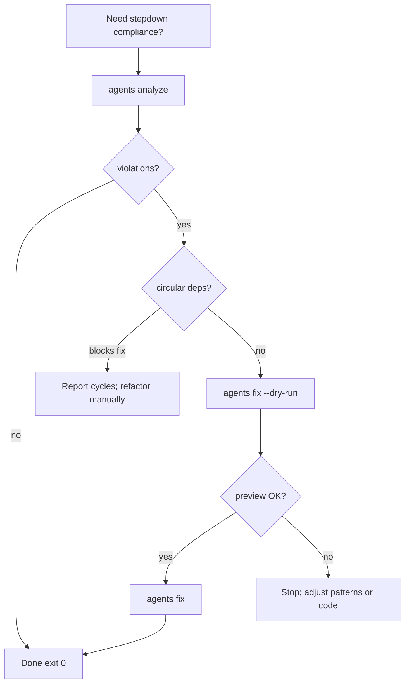

# stepdown-rule — Agent workflows

Use **`stepdown-rule agents`** commands for automation. Human-oriented `analyze` / `fix` remain for interactive use; agents should prefer the stable JSON envelope on stdout.

## Commands

| Task | Command |
|------|---------|
| Find violations | `stepdown-rule agents analyze '<glob>'` |
| Preview fixes | `stepdown-rule agents fix '<glob>' --dry-run` |
| Apply fixes | `stepdown-rule agents fix '<glob>'` |
| Config schema | `stepdown-rule agents schema config` |
| Analyze output schema | `stepdown-rule agents schema analyze-output` |
| Fix output schema | `stepdown-rule agents schema fix-output` |
| Rule IDs | `stepdown-rule agents schema rules` |

Always **quote globs** for the shell: `'src/**/*.ts'`.

## Decision tree



## Exit codes

| Code | Meaning | Agent action |
|------|---------|----------------|
| 0 | Success | Continue |
| 1 | Violations (analyze) or fix errors | Read `results` / fix input |
| 2 | Usage error | Fix command line |
| 3 | No files matched | Check globs and `--ignore` |
| 4 | Invalid config | Fix `.stepdownrc.json` |
| 5 | Internal error | Retry or escalate |

## Output contract

Stdout is **one JSON object** per run:

- `schemaVersion`, `command`, `ok`, `exitCode`, `summary`, `results`, `errors`
- Diagnostics and hints go to **stderr** only
- Default `agents fix` results omit file bodies; use `--include-content` when diff text is required
- Use `--dry-run` on fix to get `preview` (bounded diff) without writes

## Options

Shared on `agents analyze` and `agents fix`:

- `--ignore <patterns...>` — exclude globs
- `--config <file>` — default `.stepdownrc.json`
- `--rules stepdown,nested` — subset of rules

`agents analyze` only:

- `--include-graph` — include `dependencyGraph` per file

`agents fix` only:

- `--dry-run` — no writes; `preview` on changed files
- `--include-content` — full `originalContent` / `fixedContent` (high token cost)

## Examples

```bash
stepdown-rule agents analyze 'src/**/*.ts'
stepdown-rule agents fix 'src/**/*.ts' --dry-run
stepdown-rule agents fix 'src/**/*.ts'
stepdown-rule agents schema rules | jq '.[].id'
```
