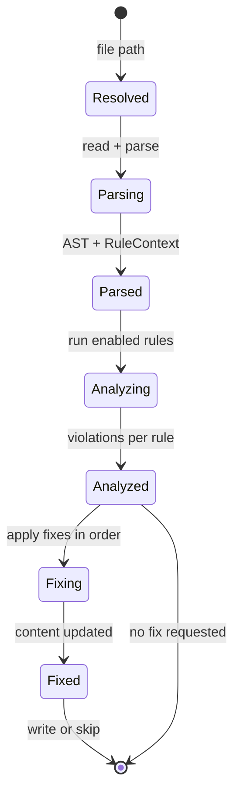
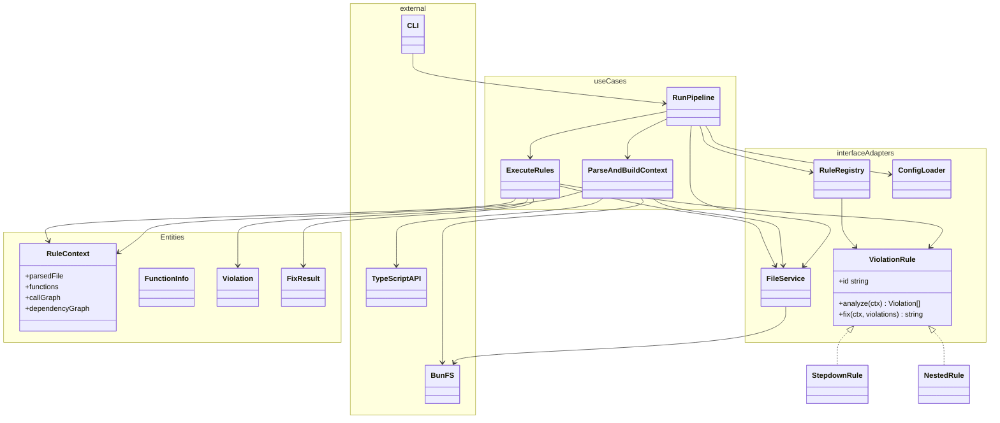
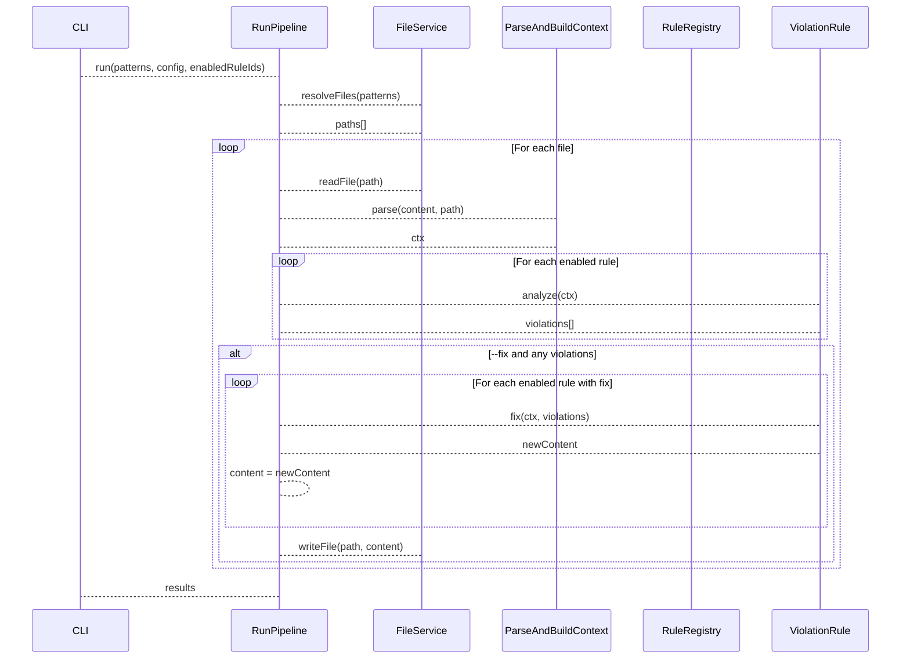

# Rule Pipeline Architecture

Efficient pipeline: **parse AST once per file**, run all enabled rules' analyses on the shared context, then run each enabled rule's fix in sequence (so fixes see the result of previous fixes).

---

## Approach

1. **Resolve** – Expand glob patterns to a list of file paths (one place; no per-rule I/O).
2. **Per file**
   - **Parse once** – Build a single AST and shared `RuleContext` (functions, call graph, dependency graph, etc.) used by every rule.
   - **Analyze all** – For each enabled rule, run `rule.analyze(ctx)`; collect violations per rule (no re-parse).
   - **Fix each** – If fixing: for each enabled rule that has a fix and reported violations, run `rule.fix(ctx, violations)` and replace file content with the result before the next rule’s fix. Order can be defined by the registry (e.g. stepdown then nested).
3. **Report** – Aggregate violations and fix results per file and overall.

Shared context keeps parsing and shared analysis (e.g. call graph) out of the inner loop; per-rule fix steps keep each fix simple and composable.

---

## State Diagram (per-file pipeline)

Lifecycle of a single file through the pipeline. The runner advances the file through these states; “Analyzed” and “Fixed” carry rule-specific payloads (violations, updated content).

Optional: “Fixing” can be refined to one state per rule (e.g. FixingStepdown, FixingNested) if you want to show each fix step explicitly.

---

## High-Level Clean Architecture (class diagram)

- **Entities**: domain types (violations, function info, context) — no framework.
- **Use cases**: orchestration (run pipeline) and rule execution (analyze / fix).
- **Interface adapters**: rule registry, file service, config; they implement ports used by use cases.
- **Frameworks / drivers**: TypeScript compiler (AST), Bun (filesystem), CLI (argv).

Layers are grouped with [namespaces](https://mermaid.js.org/syntax/classDiagram.html) (class diagrams do not support subgraphs).

- **ViolationRule**: port/interface implemented by each rule (stepdown, nested, etc.); guarantees analyze + fix (or explicit report-only).
- **RuleRegistry**: holds enabled rules and order; used by `RunPipeline` to decide which rules to run and in what order for the fix phase.
- **ParseAndBuildContext**: use case that reads the file (via `FileService`), parses with TypeScript, and builds the shared `RuleContext` once per file.
- **ExecuteRules**: use case that runs each enabled rule’s `analyze` on the same context, then runs each enabled rule’s `fix` in sequence, passing updated content to the next fix.

---

## Data flow (sequence)

This matches the “parse once → all analyses → fixes of each enabled analyses” flow and keeps a single AST and shared context per file.
